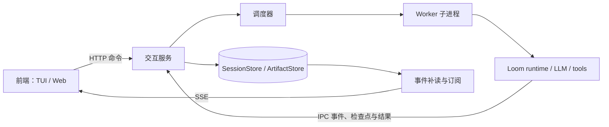

# Loom 常驻服务与持续 Session 交互设计

## 状态与范围

- 日期：2026-10-03。
- 状态：架构方案已在讨论中确认；本文为待评审的设计稿，尚未进入实现。
- 首个使用场景：复杂开发与维护。
- 本次设计范围：常驻后端、多 Session 持续交互、执行过程展示、暂停与恢复。
- 首个前端暂定为现有 TUI 的服务客户端；这一选择是设计假设，协议同时支持后续 Web 前端。

## 1. 用户意图与成功标准

用户希望 Loom 成为一个持续运行的后端服务。服务可以在没有工作时等待请求，接受多个前端和多个 Session。一个 Session 持续维护一项任务的消息、反馈、进度和执行历史，前端同时展示任务实施过程。

典型流程是：创建“维护支付模块”的 Session，调查故障、修改代码、运行测试，等待人的反馈；关闭前端后任务和历史仍然存在；再次连接同一 Session 后补充要求，继续推进。

本阶段成功标准：

1. Session 的存在和任务执行不依赖前端连接。
2. 多 Session 可独立接受输入、排队和执行，一个 Session 的长命令不阻塞其他 Session 的交互。
3. 执行期间能够接收人的补充和调整，明确展示输入何时接收、何时应用。
4. 任务能够持久化等待人的回答、暂停、恢复，并在重连后恢复展示。
5. 服务重启后能识别有效检查点和执行结果不确定的动作，不盲目重放工具副作用。
6. 消息、目标修订、执行事实和产物相互关联，为以后沉淀方法提供证据。

本阶段不实现完整领域插件 SDK、跨任务方法提炼和自动方法优化，也不建设分布式调度、多用户协作编辑或通用远程终端。它们使用本文定义的持久化任务与事件边界继续扩展。

## 2. 当前实现与需要补充的边界

当前代码已有可复用基础：

| 位置 | 当前能力 | 服务化需要的变化 |
| --- | --- | --- |
| `src/loom/runtime/engine.py` | step、done、run、工具调用、执行事件 | 增加协作控制交接点，区分一次运行结束与持续任务结束 |
| `src/loom/tasks/runner.py` | Context、工具与 LLM loop 的装配 | 从持久化任务装配运行，恢复已有 Context 和 continuation |
| `src/loom/runtime/planning.py` | 动态计划、路由、计划快照 | 导出和恢复控制器状态，支持目标修订后的重新规划 |
| `src/loom/observability/traces.py` | 执行事件、Trace、JSONL 存储 | 为服务增加持久化事件序号、游标和事务边界 |
| `src/loom/tui/` | 计划、模型流、工具结果、执行摘要展示 | 改为消费服务快照与事件，并增加输入和 Session 切换 |
| `src/loom/campaigns/store.py` | SQLite 事务、操作去重、版本检查 | 复用设计模式，建立独立的 Session 存储契约 |

需要特别处理：

- `tasks/tools.py` 的 `shell_execute` 在异步函数中使用同步 `subprocess.run`，会阻塞所在事件循环。
- `TuiEventCollector` 使用一个内存消费队列，不能直接承担多客户端广播和断线补读。
- `engine._make_emitter()` 会传播外部 sink 错误，网络订阅失败不能沿这条路径导致任务失败。
- `LoopHandle` 的运行时绑定保存在进程内 `_RUNTIME_STATE`，恢复时需要重新装配；不能将 Python handle 当作持久化检查点。
- `_task_done()` 根据 finish observation 或有效 decision 结束运行，不能直接用于判断持续维护任务的整体完成。

仓库已有 [Context Compaction and Resumable Task Runs](2026-08-01-context-compaction-resume-design.md) 设计。本文复用其中 Context、ContextWindow、Checkpoint、StepContinuation 和 CheckpointParticipant 的边界，但不把设计文档视为已实现能力。本阶段必须实现恢复所需的最小 continuation 和 participant 协议；自动摘要策略作为独立后续工作。

## 3. 核心决策与替代方案

采用“常驻交互服务 + 调度器 + 独立执行 worker + 持久化事件”的结构。

| 方案 | 取舍 |
| --- | --- |
| 在现有 runtime 上增加服务与持续任务层，选用 | 复用执行内核，同时把连接、输入、任务状态和执行恢复分开 |
| 把 `run()` 改成一个常驻交互循环 | 初期改动少，但连接生命周期、等待、恢复和执行容易耦合 |
| 引入完整工作流平台 | 可支持复杂分布式调度，但超出当前单机持续交互的需求 |

第一版采用单机、单交互服务进程、SQLite 持久化和受控数量的 worker 子进程。一个空闲 Session 不占用 worker。前端协议使用 HTTP 命令和 SSE 事件流，核心契约不绑定具体 HTTP 框架。

## 4. 核心对象和身份

| 对象 | 含义 | 持久化与关系 |
| --- | --- | --- |
| Session | 一项任务的持续交互空间 | 持久化；第一版与 Task 一对一 |
| Task | 目标、约束、工作区、计划、Context 和当前状态 | 持久化；同一 Task 可包含多个 Run |
| Run | 一次有界的任务推进 | 持久化；暂停或等待后可以恢复同一个 Run |
| Connection | 某个前端当前的连接 | 临时；多个连接可访问同一 Session |
| Command | 用户提交的消息或控制操作 | 持久化；通过 command_id 去重 |
| InputRequest | 后端需要人回答的问题 | 持久化；回答关联 request_id |
| Event | 交互与执行事实 | 持久化；每个 Session 拥有连续递增的 seq |
| Checkpoint | 可恢复执行状态 | 不可变版本；关联事件游标和执行记录 |
| Artifact | diff、日志、测试报告等较大产物 | 按内容摘要引用，不随前端断开丢失 |

标识使用 `session_id`、`task_id`、`run_id`、`command_id`、`request_id`、`checkpoint_id`。执行内部继续保留 trace_id、llm_call_id 和 tool_call_id。

恢复暂停中的 Run 保留 run_id，并创建新的 worker attempt_id。一个已结束 Run 后的下一轮交互创建新 run_id。Session 和 Task 的身份保持不变。

目标和计划分别保存 goal_revision、plan_revision。执行事件记录动作所依据的修订版本，新的目标不改写旧执行事实。

## 5. 架构与职责



### 5.1 交互服务

负责命令验证、持久化接收、状态查询、worker 协调和事件分发。交互服务是 Session 状态的唯一写入协调者，worker 通过本机 IPC 提交执行记录，不直接修改 Session 数据库。

服务使用事件日志和状态投影作为事实来源。调度器的内存队列与订阅通知只用于唤醒，服务重启后可以由数据库重建。

第一版只面向本机单用户，HTTP 默认绑定 loopback。使用安装级访问凭据，worker IPC 使用独立凭据。模型密钥留在后端配置中，不进入 Session 快照或前端事件。远程访问和多用户授权在独立设计中处理。

### 5.2 调度器

每个 Session 同时最多有一个执行者；全局并发由 `max_active_runs` 控制。第一版采用就绪任务 FIFO 排队，暂停、回答和输入变化通过持久化命令唤醒调度器。

对同一规范化工作区，第一版按整个工作区执行互斥。不同工作区可以并发。用户预先提供独立 checkout/worktree 时按不同工作区处理；本阶段不自动创建或合并 worktree。

调度器为每次 worker 分配递增的执行 epoch。worker 在开始模型或工具动作前向服务取得当前 epoch 的执行许可；过期 epoch 的事件和结果不能更新当前任务。恢复旧工作区前，还必须确认旧 worker 及其工具进程已退出，epoch 不能替代对外部副作用的核对。

### 5.3 执行 worker

worker 在收到启动描述后加载已验证的 Context、continuation、计划状态和后端配置，重新创建 registry、loop 和 runtime handle。进程内对象不通过检查点序列化。

worker 负责实际模型与工具执行。命令 IPC 接收不能被同步工具阻塞，因此 shell 工具在 worker 内也需要改为可管理的异步子进程；文件操作移出阻塞事件循环的路径。记录工具进程身份和终止结果，避免停止 worker 后留下不受控的执行进程。

worker 完成、挂起或失败后可以退出。Session 的消息、状态和检查点继续保存在服务中。

## 6. 生命周期

Session 是交互容器，任务和 Run 分别拥有状态，连接不拥有任务状态。

Task 状态：

| 状态 | 含义 |
| --- | --- |
| idle | 当前无执行，等待新输入 |
| queued | 已有推进请求，等待 worker 或工作区 |
| running | 正在执行 |
| awaiting_input | 有有效 InputRequest，已保存 continuation 并释放 worker |
| pausing | 已接收暂停，正在到达可保存边界 |
| paused | 已保存可恢复状态，需要显式恢复 |
| recovering | 正在核对检查点或不确定的动作 |
| failed | 无法继续，需要人的恢复决定 |
| completed | 用户明确结束当前任务 |

Run 状态为 queued、running、suspended、completed、stopped、failed。Task 的 awaiting_input 和主动暂停对应 suspended Run；恢复保留同一个 Run。stop_run 后 Task 同样为 paused，但原 Run 已是 stopped，后续推进创建新 Run。正常完成当前一轮后，Run 变为 completed，Task 回到 idle。

`finish` 表示完成当前 Run 的输出，不自动关闭持续 Task。`complete_task` 是用户明确结束任务的命令，记录结束依据，不能伪装成自动验证通过。completed Task 接收新工作前需要 `reopen_task`。

等待、暂停和预算耗尽不是运行成功。预算耗尽进入 paused，记录具体原因；不能使用当前 Context observation 预算触发的 `done=True / outcome=pass` 作为服务生命周期判断。

## 7. 输入与控制语义

### 7.1 持久化接收

命令先验证，再在事务内保存 Command、对应消息或控制请求及接收事件，然后返回 command_id。返回“已接收”只表示已持久化，不表示已经应用于运行。

相同 command_id 和相同规范化输入返回原接收结果；相同 command_id 携带不同输入返回冲突。该保证覆盖命令接收，不承诺任意外部工具的 exactly-once 执行。

命令状态为 accepted、applied、rejected。修改目标、计划或生命周期的命令携带 expected_task_revision，过期修改被明确拒绝。普通消息按接收顺序追加，不因为另一个客户端追加消息而冲突。

### 7.2 消息应用

- idle：新消息形成新的推进请求。
- queued：新消息进入本次待应用输入，不重复创建 Run。
- running：新消息进入输入队列，在下一个安全交接点应用。
- paused、recovering、failed：消息可保存，但不会隐式恢复执行，需要 resume 或明确的恢复操作。
- awaiting_input：普通补充消息可以保存，但不会自动替代已有问题的回答；回答必须关联 request_id。
- completed：拒绝推进消息，要求先 reopen_task。

同一边界之前收到的消息按 seq 顺序组成输入批次。worker 将输入投影到 Context 或模型消息后，事务保存 applied 记录、输入游标和更新后的检查点，再开始下一次模型请求或工具动作。

目标改变时生成新 goal_revision，保留已完成工作，记录受影响的计划和产物，在下一次执行中重新规划。第一版只接受文本指导，不提供前端直接编辑内部计划数据的接口。

前端至少展示“发送中、已接收、已应用、被拒绝”四种状态，并标明运行中的消息可能尚未生效。

### 7.3 暂停、恢复和停止

| 命令 | 行为 |
| --- | --- |
| pause | 持久化请求，阻止下一个新动作；当前动作完成或受控终止后保存检查点，进入 paused |
| resume | 从已验证检查点恢复 suspended Run；无 suspended Run 时从最新 Context 启动下一次 Run |
| stop_run | 停止当前 Run，保留消息、修改和执行历史；Task 进入 paused |
| complete_task | 在 idle 或 paused 显式结束当前 Task；queued、running、pausing 或存在未核对动作时拒绝 |
| reopen_task | 将 completed Task 恢复为 idle，保留历史并允许新一轮工作 |

pause 接收后立即展示 pausing，只有检查点提交成功后才能展示 paused。resume 在 pausing 状态被拒绝；stop_run 优先于尚未完成的 pause。重复请求通过 command_id 去重。

第一版 pause 允许当前工具在其超时预算内完成，不启动后续工具。stop_run 请求可终止的模型或工具操作停止；无法确认是否停止的副作用进入 recovering。暂停和停止都不自动回滚文件修改。

stop_run 在结果可确定时，将 continuation 中已完成的 observation、计划变化和产物引用并入最终 Context，记录被中断的 step 及 Run 终态，再进入 paused。未执行的调用保留中断记录。后续 resume 从这个 Context 创建新 Run，不能遗漏本次已经产生的结果。

complete_task 在 paused 且有 suspended Run 时，先按 stop_run 的结果保留规则结束该 Run，再结束 Task。resume 在 recovering 或 failed 时先执行恢复验证，不能绕过尚未解决的副作用核对。

### 7.4 人的输入请求

InputRequest 保存 request_id、kind、问题、选项、关联 run_id、目标版本和状态。kind 初始支持 clarification 和 recovery。

模型通过服务提供的 `request_input` 工具提交结构化问题。执行层将其识别为挂起控制结果，保存 continuation 和 input.requested 事件，释放 worker。此控制结果不作为工具失败或普通完成处理。

创建 clarification 问题是服务控制操作，在事务中关联工具执行账本和 InputRequest。挂起检查点记录该工具调用正在等待回答；恢复时把已保存的回答转换为该调用的终态 observation，不重新执行 request_input，也不创建第二个问题。supersede_input 则为原调用生成带明确中断原因的终态结果，再应用替代指导。

recovery 问题由恢复协调者创建，关联不确定的 tool operation。回答表达“确认已完成并提供证据”“确认未发生并提供依据”或“停止本轮、保留待核对状态”。控制器将核对结论写入账本后再判断是否可恢复，不把这类回答当成普通模型工具结果。supersede_input 只适用于 clarification，不能跳过未解决的 recovery 问题。

回答引用 request_id。事务检查请求仍有效、尚未回答且版本匹配，保存回答并关闭请求，再将任务放入恢复队列。重复回答返回原结果；过期回答返回明确错误。一个 Session 第一版最多有一个未解决的 InputRequest。

问题无回答时不自动消费模型 token。若需要放弃该问题并改变方向，用户通过显式 `supersede_input` 命令关闭原请求、提交替代指导，再恢复运行。

## 8. 安全交接点与恢复

### 8.1 执行边界

协作控制必须进入 `create_llm_step_function()` 内部，而不仅位于外层 run 循环。

最小安全边界：

1. 模型请求前：应用待处理输入，处理控制请求，保存请求前检查点。
2. 模型响应后、工具派发前：保存响应及待执行工具列表，检查新输入与控制。
3. 单个工具结果提交后：保存结果和更新后的 continuation，再决定是否执行下一工具。
4. step 完成时：提交新 Context、Trace、计划状态和下一阶段检查点。

目标改变后，旧响应中尚未执行的工具调用标记为 interrupted/superseded，并建立完整的协议结果组后重建请求。不得把新目标下的工具结果填入旧调用，也不得留下无法解释的半个工具对话。

服务执行入口使用显式的 drive/control 契约复用现有 step 和 registry；挂起是控制结果，不通过抛出通用异常实现。当前 step 捕获 BaseException 的路径不能把暂停转换为 INTERNAL。现有一次性 `run()` 调用保留兼容行为。

### 8.2 检查点内容

检查点至少包含：

- schema_version、session_id、task_id、run_id、执行 epoch。
- 完整 Context、目标与计划修订、PlanningRuntime 和路由 participant 状态。
- 当前模型消息窗口，包括已形成的工具调用与结果配对。
- StepContinuation：trace_id、执行阶段、LLM/工具计数、已完成 observation 和未完成调用。
- 已应用输入游标、待回答请求、控制请求与预算使用。
- 已提交事件游标、工具执行账本游标、所需配置和方法版本引用。

检查点引用的事件、工具结果和产物必须先持久化。提交检查点指针、任务投影和关联事件在同一 SQLite 事务完成。恢复时验证 schema、引用摘要和配置兼容性。

本阶段保存完整的有界活动消息窗口，并限制窗口、单次工具输出和 Run 的预算。超过上限时暂停并解释原因，不静默丢弃消息；自动 compaction 后续接入既有设计。

### 8.3 工具执行账本

工具派发前保存 operation_id、tool_call_id、输入摘要、工作区、effect_kind 和执行许可。工具结束后保存终态、返回值或 ArtifactRef，然后更新 continuation。

effect_kind 区分 read_only、side_effecting 和 service_control；service_control 仅用于核心提供、可事务去重的输入请求等控制工具。未知工具按 side_effecting 处理。shell 命令默认有副作用，不根据命令文本猜测它只读。

服务在派发后、终态提交前崩溃时，工具可能已经产生副作用。恢复按以下原则执行：

- 结果已持久化：直接恢复结果，推进 continuation，不重放工具。
- 只读操作结果缺失：确认旧执行者已退出后，按预算允许重新执行，并记录新 attempt。
- 副作用结果缺失：进入 recovering，核对当前文件、进程或外部状态；无法自动核对时创建 recovery InputRequest。

人的核对结论记录为 tool.reconciled，附带操作者陈述和证据引用，不能伪造历史 tool.completed。只有结果已确定、下一执行边界明确后才能恢复。

服务重启不直接将所有 running 任务改为 queued。先核对 worker、执行账本和检查点：状态完整且无不确定副作用的 Run 回到恢复队列；其余进入 recovering。人工 paused 和 awaiting_input 保持原状态。

## 9. 持久化与事件

默认服务数据目录为 `.loom/service/`：

```text
.loom/service/
  service.sqlite
  artifacts/
```

数据库保存 sessions、tasks、runs、commands、messages、input_requests、events、checkpoints、tool_operations 和 worker_attempts。ArtifactStore 保存大型日志、diff、检查点正文和完整模型交互，复用 core.ArtifactRef 的摘要和引用契约。

SessionStore 提供接收命令、提交执行记录、加载快照、读取游标后事件、分配执行 epoch 和恢复核对等事务操作。它参考 campaign store 的去重和版本控制模式，不直接复用 campaign 特有的阶段、预算和审批表。

所有对前端可见的事件先提交，再发布通知。事务失败是执行持久化故障，阻止继续派发动作；网络订阅故障只影响该连接。

事件信封：

```json
{
  "schema_version": "loom.session.event.v1",
  "session_id": "sess_...",
  "seq": 123,
  "event_id": "evt_...",
  "type": "tool.completed",
  "at": "2026-10-03T08:00:00Z",
  "task_id": "task_...",
  "run_id": "run_...",
  "command_id": null,
  "goal_revision": 2,
  "plan_revision": 4,
  "trace_id": "trace_...",
  "payload": {}
}
```

seq 由数据库按 Session 分配，跨 Run 和服务重启连续递增。worker 记录同时携带 attempt_id 和 worker_record_id，以便重传去重。Trace 仍是执行证据；信封为现有 runtime 事件增加 Session 关联，不建立另一个独立的事实解释器。

交互新增事件包括 command.accepted/applied/rejected、message.created、task.state.changed、task.goal.revised、input.requested/answered/superseded、checkpoint.committed 和 worker.failed。原有 run、step、plan、llm 和 tool 事件保留关联标识。

模型流式增量可以按短时间窗口合并成有 offset 的文本块，再持久化和发布；UI 不消费尚未持久化的增量。最终消息或模型响应保存完整正文和摘要，客户端通过标识与 offset 合并，不能在重连时重复追加文本。

第一版不自动删除 Session 事件。订阅缓存有界；慢客户端超过缓存后断开并补读，不无限占用内存，也不反向阻塞执行。大型 stdout、stderr 和 diff 使用 ArtifactRef、摘要和截断标记，详情按需获取。

## 10. HTTP 与 SSE 契约

| 方法与路径 | 作用 |
| --- | --- |
| `POST /v1/sessions` | 创建 Session 和 Task，command_id 用于创建去重 |
| `GET /v1/sessions` | 分页列出 Session 的摘要与状态 |
| `GET /v1/sessions/{id}/snapshot` | 获取一致性快照及 event_cursor |
| `POST /v1/sessions/{id}/commands` | 提交消息、回答和控制命令 |
| `GET /v1/sessions/{id}/events?after=N` | SSE 订阅 N 后的事件 |
| `GET /v1/sessions/{id}/history?before=N&limit=L` | 分页读取历史事件 |
| `GET /v1/sessions/{id}/artifacts/{digest}` | 获取该 Session 已引用的产物 |

命令包含 command_id、type、payload；需要状态版本校验的操作另带 expected_task_revision。已接收的异步命令返回 HTTP 202 和稳定接收结果。非法输入返回 400，未知对象返回 404，状态或命令内容冲突返回 409。

初始命令类型为 submit_message、answer_input、supersede_input、pause、resume、stop_run、complete_task 和 reopen_task。创建 Session 的 payload 包含 title、objective、workspace 和后端模型配置引用；submit_message 包含 content；answer_input 包含 request_id 和 answer；supersede_input 包含 request_id 和替代 content。其他控制命令可以携带 reason，不接收模型密钥或任意 Python 实现。

快照包含 Task 状态、修订版本、当前 Run、完整当前计划、有效输入请求、最近消息、产物摘要和 event_cursor。快照与 cursor 从同一数据库读快照取得。

客户端先取得游标 N 的快照，再订阅 N 之后的事件。补读按 seq 读取持久化日志，通知只作为继续读取的唤醒信号，避免“读历史”和“进入实时订阅”之间漏事件。

SSE 的 id 使用 Session seq，事件名使用 type，data 使用完整信封。首次连接使用 after；重连携带 Last-Event-ID 时采用两者较大的合法游标。大于当前最大 seq 的游标被拒绝，要求重新获取快照。客户端按 seq 去重，协议允许重复交付。

SSE 使用心跳保持连接活跃，前端断开不产生 pause 或 stop_run。浏览器 EventSource 的重连和 Last-Event-ID 行为依据 [HTML Server-sent events 标准](https://html.spec.whatwg.org/multipage/server-sent-events.html)；TUI 客户端实现同样的游标语义。浏览器采用同源凭据，TUI 使用服务凭据。

## 11. 前端职责与 TUI 适配

前端维护展示投影和订阅游标，不持有唯一的任务状态，不直接在本机替服务调用模型或工具。

第一版 TUI 包含：

- Session 列表：任务标题、状态、等待输入提示和当前执行摘要。
- 持续对话：用户消息、助手阶段回复、输入接收和应用状态。
- 当前工作：目标、计划、活动步骤、暂停和等待原因。
- 执行时间线：模型输出、工具动作、错误与恢复。
- 开发产物：diff、测试结果、日志和阶段总结的详情入口。
- 输入与控制：提交消息、回答问题、暂停、恢复、停止本次执行。

切换 Session 只切换订阅和展示，不停止后台 Run。不同客户端可以观察同一 Session；第一版命令由服务串行接收，并通过版本和 request_id 防止相互覆盖，不实现多人协作编辑。

现有 TUI 的事件摘要、计划和工具展示可以复用，但事件来源改成服务客户端适配器。适配器为当前 UI 提供本地队列；队列只是该连接的消费缓冲。TuiPlugin 不再承担服务模式中启动和等待任务前端的职责。

旧的一次性 CLI 和进程内 TUI 入口保持可用。新增服务启动和客户端连接入口；具体 HTTP 框架与命令拼写在实现计划中选择，不影响本文协议。

## 12. 故障处理与运行约束

| 情况 | 处理 |
| --- | --- |
| 前端断开、切换或退出 | 执行按后端状态继续；重连恢复快照和事件 |
| 慢订阅者 | 有界缓冲，断开后补读，不阻塞其他连接 |
| worker 退出 | 记录失败，释放调度占位；先核对进程与副作用再释放工作区 |
| SQLite 或产物写入失败 | 不发布未提交事件，不派发新动作；服务报告存储不可用，存储恢复后补记故障并核对未完成动作 |
| 服务重启 | 重建就绪队列，验证检查点，核对未完成操作，不盲目重跑 |
| 目标修订与旧响应冲突 | 保存旧响应和未执行标记，按新修订重新规划 |
| 预算或消息窗口超限 | 保存状态并暂停，展示限制原因 |
| 服务正常关闭 | 停止新任务派发，请求活动 worker 到达检查点；超时执行者按不确定操作记录恢复 |

服务与 worker 的模型 token、工具次数、运行时长和输出尺寸预算独立于前端连接时长。等待人的输入不消耗执行预算。暂停控制和恢复判断不计为工具失败的质量证据。

本文不承诺故障时任何工具副作用都只发生一次，也不承诺所有外部动作都可以撤销。保证的是接收命令去重、已提交结果不重放、不确定副作用显式核对，以及执行事实不被新输入覆盖。

## 13. 模块边界

建议新增模块，名称用于表达职责：

```text
src/loom/service/
  contracts.py       Session、Task、Command、Event、InputRequest
  store.py           SQLite 事务、去重、投影和游标
  controller.py      输入、控制、状态迁移和恢复协调
  scheduler.py       就绪队列、并发限制、工作区互斥
  workers.py         worker 生命周期、epoch 和 IPC
  api.py             HTTP 命令、快照、历史和 SSE
  cli.py             服务启动与检查

src/loom/client/
  protocol.py        HTTP 命令、SSE、重连和去重
  projection.py      事件应用与展示状态

src/loom/runtime/
  control.py         正常推进、挂起、暂停和停止契约
  checkpoints.py     codec、continuation、participant 与恢复验证
```

LLM step 只调用控制与检查点生命周期接口，不承担 HTTP 或数据库细节。任务 runner 负责执行装配，TUI 负责展示和输入。不得把服务 controller 的生命周期判断全部写入 engine.py 或 llm/api.py。

## 14. 对后续插件与方法沉淀的接口

本阶段事件和产物记录保留 task_kind、plugin_version_refs 和 method_version_refs；coding 是初始 task_kind，尚未选择的方法引用为空。

用户反馈关联输入、Run 和产物版本；计划变化关联目标修订；执行事件记录实际使用的方法版本。后续方法提炼从这些事实提出候选，不能把一次阶段回复直接作为跨任务通用方法。

Session 快照是运行所需知识的投影，不等于完整长期方法库。自动提炼、评价和方法启用使用现有 evaluation/evolution/optimize 的契约进行后续适配，本阶段不自动修改正在运行的工艺版本。

## 15. 验收与验证策略

采用确定性的假模型、可控制工具和故障注入验证协议；关键不变量不依赖真实 LLM 成功率。

1. **接收去重**：同 command_id 重试不产生重复消息或 Run；同编号不同正文返回冲突。
2. **单 Session 执行约束**：连续消息、多客户端命令、恢复重试均不会出现两个活动执行者。
3. **多 Session 响应**：一个 Session 执行长 shell 命令，另一个仍能接收消息、取得快照和事件。
4. **输入应用**：执行中输入在下一安全边界生效，接收和应用状态可区分；旧目标动作保留原修订。
5. **暂停与停止**：pausing 与 paused 的时点正确，暂停后不启动下一动作，stop_run 不伪装为任务完成。
6. **人的回答**：等待后 worker 已释放；回答重试不重复恢复，过期 request_id 不推进任务。
7. **快照与事件衔接**：并发提交事件发生在快照与订阅之间仍可补读，重复事件不会重复渲染。
8. **前端脱离**：断线、慢连接和切换 Session 不影响执行结果；两个观察者各自收到完整事件。
9. **恢复结果**：在工具派发、结果提交、检查点提交附近分别注入崩溃；已提交动作不重放，未知副作用进入 recovering。
10. **计划恢复**：计划工具更新后、Context 回写前崩溃，participant 状态恢复正确。
11. **执行者隔离**：过期 epoch 的结果被拒绝，旧工具进程未确认退出时不恢复共享工作区。
12. **持久化故障**：未提交内容不出现在 UI，也不用于启动后续副作用。
13. **持续维护流程**：首轮修改与测试完成回到 idle；下一轮消息继续同一 Task，历史和产物可关联。
14. **兼容性**：已有 runtime、task runner 和 TUI 测试继续通过，一次性调用行为保持原契约。

交付可按存储与命令、受控执行与恢复、事件协议、TUI 客户端逐步集成，但第一阶段验收包含全部交互闭环，不能只交付一个把 run_generic_task 包在 HTTP 中的接口。

## 16. 评审关注点

本文已选择单机服务、独立执行 worker、一个 Session 一项 Task、同 Session 串行执行、共享工作区互斥、HTTP + SSE、持久化命令和事件、在 LLM/工具边界应用输入，以及副作用不确定时先核对。

评审重点是这些交互语义和边界是否符合持续开发维护的使用方式。TUI 是首个前端的暂定选择；改为 Web 不改变 Session 和执行协议。本文评审确认后，再编写实现计划和选择具体框架。
