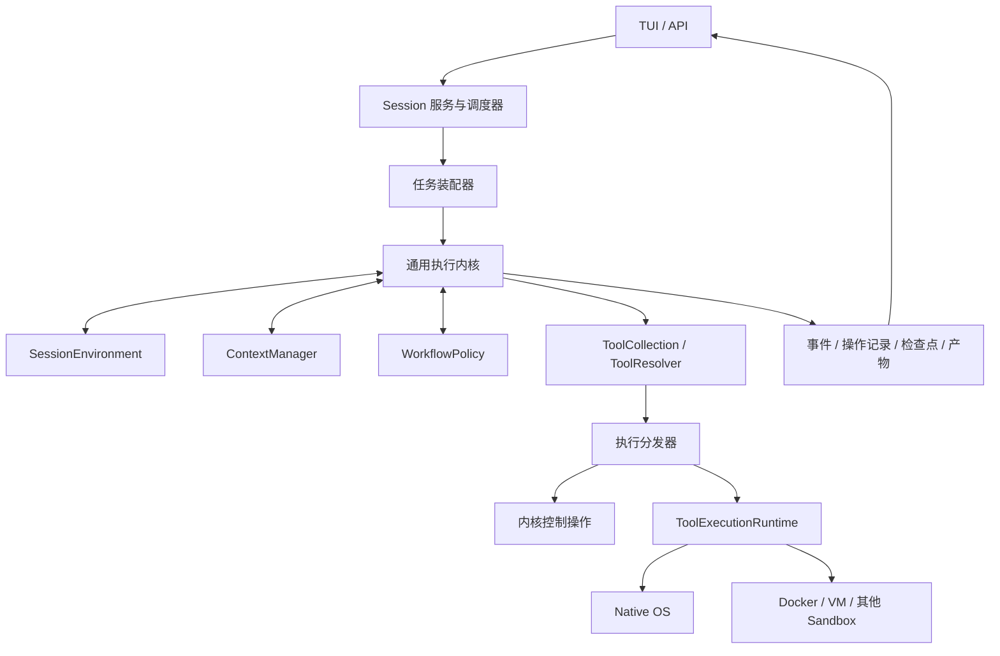

# Loom 通用任务执行与插件 Runtime 设计

## 1. 状态与目标

- 日期：2026-10-04。
- 状态：目标设计；第一阶段已实现，当前支持范围见第 17 节。Docker/VM 等后端仍属于后续阶段。
- 目标：让编程、资料调研、文档处理、数据分析和浏览器操作使用同一个持久化执行内核，由插件配置具体能力。
- 核心决策：上下文管理、SessionEnvironment、工具集合、工具执行 runtime、动态 workflow 是五个独立扩展点。
- 第一阶段：包装现有能力，默认使用 native OS 执行；Docker、VM 和其他 sandbox 通过相同执行协议扩展。

本文承接以下设计：

- [Generic Task Runner](2026-07-01-generic-task-runner-design.md)：复用 Context、最小 loop 和工具解析，不另建领域执行内核。
- [Context Compaction and Resumable Task Runs](2026-08-01-context-compaction-resume-design.md)：区分领域状态、模型窗口、执行事实和恢复状态。
- [常驻服务与持续 Session 交互](2026-10-03-persistent-service-sessions-design.md)：保留持续交互、检查点、操作记录和前后端分离。
- [自动 workflow 路由](2026-08-02-auto-plan-workflow-routing-design.md)：将现有 ReAct / Plan 路由逐步适配为 workflow 策略。

本文扩展早期 task runner 对固定 blueprint 的限制：允许模型提出受约束、可验证、可持久化的 workflow 修订。执行内核、工具能力和运行位置仍由服务端配置决定，模型不能任意替换这些组件。

## 2. 实施前的实现与耦合位置

实施前核心已经具备通用基础，问题主要位于装配和执行策略；下表保留迁移依据：

| 代码 | 当前能力或限制 | 目标变化 |
| --- | --- | --- |
| `core/models.py` | Context 有 identity、goal、state、knowledge、affordances；资源以 ResourceRef 表达 | 保留这些领域契约，扩展可配置投影与产物引用 |
| `runtime/engine.py` | loop、step、tool registry、取消、事件与 Trace | 作为共享内核，工具调用接入执行 runtime adapter |
| `runtime/plugins.py` | LoopPlugin 提供 start、trace_sink、stop；默认容忍观察插件失败 | 保留观察接口，增加独立、必须成功装配的执行插件契约 |
| `tasks/runner.py`、`tasks/tools.py` | 工具定义与实现固定为文件、shell 和任务控制工具 | 从 ToolCollection 装配定义和绑定 |
| `service/agent.py` | 直接装配 PlanningRuntime、ManagedStep、task tools；专门包装 shell 进程管理 | 共用任务装配器，由执行 runtime 接管具体工具执行与进程控制 |
| `llm/managed_step.py` | 内置消息窗口和 planning 快照；字符窗口超过限制时暂停 | 注入 ContextManager 与 WorkflowPolicy，保留可恢复执行阶段 |
| `service/contracts.py` | 创建 session 必须绑定存在的目录；plan_mode 是固定字段 | 引入任务插件配置与可选资源，保留旧字段的兼容映射 |
| `service/scheduler.py` | 按 canonical workspace 独占执行 | 按资源声明与 runtime 容量调度 |
| `runtime/planning.py` | 计划工具、执行阶段约束、计划与路由恢复 | 包装为 LegacyPlanningWorkflow，逐步增加动态 workflow 实现 |

已有上下文压缩设计不等于当前持久执行具备自动压缩。迁移时必须显式实现 ContextManager 的窗口管理和恢复协议。

## 3. 对象与职责

### 3.1 五个扩展点

| 组件 | 负责 | 不拥有的职责 |
| --- | --- | --- |
| `SessionEnvironment` | session 的运行上下文、资源绑定、连接及生命周期；提供环境描述与资源声明 | Session 数据库的写入协调、具体工具执行和 workflow 决策 |
| `ContextManager` | 领域状态到模型窗口的投影、知识检索、结果吸收、窗口预算和压缩 | 删除完整事件历史、修改内核预算、任意改变已接受的目标 |
| `ToolCollection` | 工具定义、实现入口、所需能力、结果契约和恢复描述 | 启动容器或 VM、管理任务进度 |
| `ToolExecutionRuntime` | 在 native OS、Docker、VM 等后端执行工具；管理执行句柄、流式输出、取消和状态查询 | 决定任务是否完成、修订目标、自动重放不确定的副作用 |
| `WorkflowPolicy` | 提出节点与依赖、选择后续工作、观察结果、判定阶段完成和提出修订 | 绕过能力限制、直接执行工具、替换执行后端 |

`SessionEnvironment` 管理 session 的上下文、资源与连接生命周期。`ToolExecutionRuntime` 管理工具调用在 native OS、Docker、VM 等后端的实际执行，两者分别配置、分别恢复。

一个 session 环境可以绑定本地目录、浏览器会话、外部系统连接和产物空间。工具执行 runtime 使用这些资源的引用，负责如何在指定执行位置操作它们。一个 session 可持有多个 runtime；第一阶段先支持一个默认 runtime，后续再加入工具绑定的显式选择。

### 3.2 内核职责

执行内核与 service 共同维护统一语义：

1. Session、Task、Run、attempt、command 和用户输入的身份及状态。
2. 步数、模型调用、token、活动时长等预算，以及暂停、停止和取消。
3. 当前能力检查、workflow 修订校验、资源占用与执行准入。
4. 工具操作记录、事件顺序、检查点一致性与恢复决策。
5. 产物引用和最终结果的提交。

交互服务继续作为 Session 持久状态的唯一写入协调者。插件通过统一执行服务提交事件、操作结果和状态快照，不绕过协调者修改数据库。

前端连接生命周期不控制 session 或工具 runtime 生命周期。关闭 TUI 只是断开前端；是否暂停任务由持久化控制命令决定。

## 4. 总体结构与装配



统一装配器服务于一次性 task runner 和持久 session worker，避免两处分别实现工具、上下文和 workflow 策略。

装配顺序：

1. 解析 TaskSpec、插件 manifest、版本和配置，验证依赖及能力。
2. 创建或恢复 SessionEnvironment，得到资源引用与占用声明。
3. 加载 ToolCollection，形成完整 catalog 与实现绑定。
4. 创建或重连 ToolExecutionRuntime，验证实际可执行的工具入口与资源映射。
5. 初始化或恢复 ContextManager、WorkflowPolicy 和当前 continuation。
6. 校验所有组件一致后取得执行租约，才允许执行新的工具操作。

模型 provider 继续复用现有配置与 API；本设计不要求将 provider 合并进五个接口之一。

## 5. 插件契约与生命周期

### 5.1 Manifest 与配置

每个执行插件具有稳定的 `plugin_id`、插件版本、配置版本、状态 schema 版本、依赖和支持的能力声明。服务端注册表将 manifest 映射到可信实现。

Session 和检查点只保存插件标识、版本、配置摘要与 JSON 状态，不能根据数据中的任意模块路径导入 Python 代码。第一阶段使用显式注册表即可，不需要立即引入自动安装或插件市场。

配置中使用连接与凭据引用；密钥、socket、进程对象、Python callable 不进入检查点。

### 5.2 生命周期

| 阶段 | 行为 |
| --- | --- |
| validate | 检查配置、依赖和请求能力；不执行任务副作用 |
| open / prepare | 创建环境或执行资源，登记可恢复的资源身份 |
| restore | 从受版本约束的 JSON 状态恢复插件逻辑状态 |
| reconnect | 对外部资源执行显式重连与存活检查 |
| snapshot | 导出可持久化状态，不依赖当前进程对象 |
| close | 按保留策略释放资源；不能把前端断开等同于关闭 |

状态迁移必须显式注册并可测试。无法迁移的检查点进入说明原因的暂停或恢复失败状态，不静默重置插件状态。

执行插件属于必要依赖，装配失败不能被现有观察插件的 fail-open 行为吞掉。TUI、日志等观察插件继续使用 LoopPlugin；它们不控制执行能力和检查点提交。

准备过程中失败时，释放已创建且不再使用的资源，并记录清理结果。未能释放的资源保持可追踪身份，供恢复与清理流程处理。

## 6. SessionEnvironment：Session 环境管理

拟议契约，名称用于表达职责，不是已发布 API：

```text
open(session_environment_spec, session_services) -> SessionEnvironmentHandle
resources(handle) -> ResourceBinding[]
snapshot(handle) -> VersionedState
restore(state) -> SessionEnvironmentHandle
reconnect(handle) -> SessionEnvironmentStatus
close(handle, retention_policy) -> CloseResult
```

SessionEnvironmentHandle 关联 session 与环境身份。ResourceBinding 包含稳定资源 ID、类型、访问方式、执行后端中的映射和占用声明。

环境描述可以提供任务工作目录、浏览器 session 引用、数据源引用、连接引用及产物空间。纯问答或调研任务可以没有目录资源。

ResourceBinding 不能仅以宿主机路径代表跨后端资源。例如同一 workspace 在宿主机上的路径与容器内的 `/workspace` 是两个映射；工具解析的是当前执行后端中的逻辑资源路径。

Session 的命令、消息与历史仍由 service 管理，SessionEnvironment 可以组织 session 特有的资源与描述，但不能引入第二套独立的持久化消息事实源。

## 7. ContextManager：上下文与模型窗口

### 7.1 四类状态

| 状态 | 含义 | 保存方式 |
| --- | --- | --- |
| Context | 目标、约束、领域事实、决策、知识、workflow 投影和产物引用 | 版本化领域状态 |
| ContextWindow | 本轮模型可见的固定指令、摘要、近期完整交互与选中的证据 | 可替换的模型窗口及其 lineage |
| EventLog / Trace | 完整请求、响应、工具结果、修订和压缩事实 | 追加记录；大内容通过 artifact 引用 |
| Checkpoint | Context、窗口、插件状态、执行 continuation、游标和未完成操作引用 | 一致的可恢复快照 |

模型窗口是 Context 和执行证据的投影，不是任务事实的唯一存储。

### 7.2 拟议契约

```text
project(context, workflow_view, available_tools, model_budget) -> ContextWindow
ingest(context, committed_event_or_result) -> ContextUpdate
compact(window, context, policy) -> CompactionResult
snapshot() -> VersionedState
restore(state) -> RestoreResult
```

ContextUpdate 由内核校验后提交。用户确认的目标和固定执行约束保持来源与修订身份，插件生成的摘要不会自动获得同样的权限。

压缩策略应满足：

1. 在模型窗口预算中预留回复、工具 schema 与后续结果的空间。
2. 保留目标、约束、当前节点、待处理输入和关键事实。
3. 保留近期交互，并保持 assistant tool call 与 tool result 的完整配对。
4. 将大结果保存为 artifact，模型窗口提供摘要、范围与可读取引用。
5. 结构化摘要记录来源事件或 artifact，支持增量更新。
6. 压缩事件和新窗口一起持久化，恢复使用已提交窗口，不重新随机生成摘要。
7. 无法获得有效窗口时明确暂停；overflow 恢复次数受策略约束。

长期知识仍与 KnowledgeLayer、资源或 artifact 的来源相连。按任务选择的检索器可以作为 ContextManager 内部组合能力，不需要再建立与执行证据无关的记忆状态。

## 8. ToolCollection：定义、解析与执行绑定

拟议契约：

```text
catalog(session_environment_descriptor) -> ToolCatalog
bindings() -> ToolBinding[]
resolve(catalog, context, workflow_node, affordance_budget) -> ToolResolution
reconcile(operation, runtime_evidence) -> ReconciliationResult
```

集合提供所有可用工具；现有 ToolCatalog、ToolResolver 和 AffordanceBudget 用于挑选本轮暴露给模型的工具。运行时仍检查工具是否在当前能力范围内，不能只依赖模型看到的 schema。

ToolBinding 应包含：

- namespaced tool ID、版本、输入和输出 schema。
- 执行入口：实现包与入口 ID，或控制操作 ID。
- 所需资源、runtime 能力与执行位置约束。
- 副作用描述、支持的幂等方式和结果核验入口。
- 超时、输出大小、流式输出与产物序列化策略。

对模型暴露的名称与内部 namespaced ID 通过显式映射关联，避免多个集合的同名工具冲突。现有工具名称可以作为兼容别名。

工具副作用和恢复能力由定义显式声明，不能根据 `read`、`write`、`shell` 等名称猜测。

`request_input`、workflow 修订、`finish` 等工具属于内核控制平面：由协调者在检查点边界处理，不送到容器内直接修改 Session 数据库。普通文件、shell、浏览器和外部连接操作通过 ToolExecutionRuntime 执行。

同一工具集合可绑定不同执行 runtime；某些只支持特定运行位置的工具必须声明限制。不支持的入口在装配或选择阶段报告能力不匹配，不能悄悄退回宿主机执行。

## 9. ToolExecutionRuntime：实际执行后端

### 9.1 拟议契约

```text
prepare(runtime_spec, resource_bindings) -> RuntimeHandle
execute(handle, invocation, event_sink) -> ExecutionResult
inspect(handle, operation_id, execution_id?) -> ExecutionStatus
cancel(handle, operation_id, execution_id?) -> CancellationResult
snapshot(handle) -> VersionedState
restore(state) -> RuntimeHandle
reconnect(handle) -> RuntimeStatus
close(handle, retention_policy) -> CloseResult
```

第一阶段 `execute` 可以等待完成并转发事件，后端内部仍需登记执行身份。后续可以增加 submit / wait 分离接口，持久化语义保持一致。

### 9.2 Invocation 与结果

Invocation 至少包含：

```text
session_id / run_id / attempt_id
operation_id / tool_call_id
tool_id / tool_version / entrypoint_id
runtime_id / resource_refs
input / deadline / execution_limits
goal_revision / workflow_revision / node_id
```

跨进程和 sandbox 的调用使用可序列化入口与参数。实现包必须部署在目标后端，由执行 agent 将入口映射到已安装实现，不能直接序列化宿主机 Python callable。

ExecutionResult 包含结构化输出或 artifact 引用、执行状态、错误分类、资源用量、输出事件及 execution_id。runtime 不直接修改领域 Context，结果由内核转换为现有 Observation / Result 并交给 ContextManager 与 workflow。

ExecutionStatus 区分 `not_started`、`running`、`succeeded`、`failed`、`cancelled` 和 `unknown`。只有后端能明确证明没有开始时才能报告 `not_started`；查不到记录或失联不能自动解释为未执行。

错误分类需要区分参数错误、工具业务错误、runtime 不可用、执行超时、取消和结果不确定。原始诊断通过结构化字段或 artifact 保留。

### 9.3 后端实现

| 后端 | 执行方式 | 必须记录的恢复信息 |
| --- | --- | --- |
| Native OS | 本机工具实现与受管理进程；先包装现有 task tools | runtime 身份、operation 映射、受管理进程身份和输出位置 |
| Docker | 在指定容器中通过执行 agent 调用已部署工具 | 容器身份、实现版本、资源挂载、operation / execution 映射 |
| VM | 通过 VM 内执行 agent 调用工具 | VM 与 agent 身份、实现版本、资源映射和执行状态引用 |
| 其他 sandbox | 实现同一协议与能力声明 | 后端稳定身份、状态查询与取消能力 |

Native OS 插件不等同于 sandbox。具体隔离、网络和资源限制由后端能力与服务端配置表达，不因接口统一而宣称具有相同保障。

第一阶段一个 session 配置默认后端。后续可以显式配置某个 ToolBinding 使用其他已装配后端，例如文件与 shell 在容器中执行，外部连接工具在指定宿主机 agent 上执行。模型只能使用已授予的绑定，不能自行切换执行位置。

## 10. Dynamic workflow 与 Plan

### 10.1 Workflow 状态

Workflow 是可修订、可恢复的工作结构；Plan 是它面向用户的投影。节点不必对应一轮 LLM 或一个工具事件。

WorkflowNode 至少包含：

```text
id / objective / dependencies
executor_kind / executor_config
required_capabilities / resource_refs
completion_criteria / status
artifact_refs / revision / provenance
```

支持的 executor_kind 从明确注册的集合选择：

- LLM 工具循环：允许节点内部运行一个有界的 ReAct loop。
- 确定性操作：调用指定工具或已注册处理过程。
- 子 loop：调用已装配的 MinimalLoopDefinition。

节点初始状态可为 `pending`，满足依赖后成为 `ready`，执行时为 `running`，终态为 `succeeded`、`failed`、`skipped` 或 `superseded`；需要输入或资源时为 `blocked`。Run 的暂停和停止仍由外层控制语义表达。

### 10.2 策略接口与修订

```text
propose(task, context, workflow_state) -> WorkflowProposal
observe(committed_result, workflow_state) -> WorkflowProposal?
next(workflow_state, resource_status) -> ReadyNode[]
completion(task, workflow_state, artifacts) -> CompletionAssessment
snapshot() -> VersionedState
restore(state) -> RestoreResult
```

WorkflowPolicy 提出变更，内核校验并提交，不能通过直接修改可变图绕过检查。Proposal 记录依据、base_revision 和具体变更：添加节点、修改未执行节点、调整依赖、替代后续工作或请求用户输入。

提交时检查：

1. base_revision 仍为当前版本，节点 ID 唯一，依赖存在且无环。
2. 执行类型、能力与资源属于已装配范围。
3. 节点数、修订次数、深度和执行预算在配置上限内。
4. 已完成节点的事实和产物保持不变；重做工作创建新节点并记录关联。
5. 运行中节点的修改只能在安全边界应用；需要中断时先处理该节点的执行与副作用。
6. workflow 状态、revision、插件状态与修订事件一致提交。

模型可以根据结果建议增加核验、补充资料或改走另一条路径。没有新增信息时的反复重规划应由修订预算限制。

例：

```text
确定问题 → 搜集资料 → 综合分析 → 输出报告
                         ↓ 发现证据冲突
                      补充核验 → 更新分析
```

简单任务只需一个 ReAct 节点，不强制生成完整计划图。第一阶段 workflow 节点顺序执行；并行节点执行属于后续扩展，需要先支持资源占用与多个 continuation。

### 10.3 完成语义与兼容

节点完成、Run 完成和持续 Task 完成分别处理。`finish` 提交候选最终输出；workflow 根据配置的完成条件决定是否还有工作，service 保持现有持续 session 的后续消息语义。

简单问答可以采用直接回答完成策略。需要文件、报告或外部变更的任务采用对应输出契约和可选验证器，不要求所有任务都运行同一种验证流程。

将现有 PlanningRuntime 包装为 LegacyPlanningWorkflow，保留 `off / auto / force`、计划控制工具、路由阈值和快照恢复。后续 DynamicWorkflowPolicy 增加节点与依赖；TUI 继续消费 plan 投影，并逐步展示 workflow revision、节点与阻塞原因。

用户补充要求作为持久化输入在安全边界应用，先形成 goal revision，再产生对应 workflow proposal。旧动作记录其原有修订，不改写历史解释。

## 11. 单次执行、检查点与恢复

### 11.1 执行路径

1. 取得执行租约，处理当前用户输入与控制命令。
2. workflow 选择可执行节点，解析工具和资源；ContextManager 构建模型窗口。
3. 模型提出调用，或确定性节点产生调用；内核验证参数、能力、资源和预算。
4. 创建稳定 operation_id，在持久化操作记录中登记待执行状态和调用身份。
5. ToolExecutionRuntime 按 operation_id 登记执行，再执行并转发事件。
6. 内核提交结果、artifact 引用、观察事实、workflow 变更和检查点，推进 continuation。
7. 检查控制命令与预算，再进行下一次动作。

控制平面操作使用同样的操作身份和检查点边界，但在协调者内执行，不分发到 sandbox。

runtime 必须支持在 execution_id 尚未回传时按 operation_id 查询。这样服务在派发后、收到句柄前崩溃，也不会因为缺少句柄而盲目重复调用。

### 11.2 检查点组成

```text
Checkpoint
  schema_version / checkpoint_id / event_cursor
  session_id / run_id / attempt_id / input_cursor
  goal_revision / workflow_revision / node_id
  context / context_window / step_continuation
  plugin_manifest_and_config_digest
  plugin_states[plugin_instance_id]
  runtime_refs / pending_operation_refs
  budget_counters / resource_claims
```

StepContinuation 保留模型响应、未执行调用、tool_index、等待输入等现有可恢复阶段。WorkflowContinuation 记录节点执行位置，两者不能互相替代。

插件 snapshot 应对应同一执行边界。协调者先验证所有快照，再将内部状态和检查点一致提交；提交失败不能继续推进新动作。runtime 的外部执行效果无法与数据库原子提交，必须通过独立的操作记录与核验衔接。

runtime 事件携带 operation_id、execution_id 和源事件序号，服务协调者完成去重并分配 Session seq，插件不自行生成多个相互冲突的 Session 游标。

### 11.3 恢复决策

恢复顺序为：验证配置与 schema，恢复插件逻辑状态，重连资源和执行 runtime，核验未完成操作，再恢复模型窗口与执行游标。

| 操作记录和后端证据 | 恢复行为 |
| --- | --- |
| 已持久化终态结果 | 复用结果，补齐尚未提交的投影，跳过执行 |
| runtime 确认仍在运行 | 重新附着事件与结果，不再次派发 |
| runtime 明确确认未开始 | 按当前控制和能力检查决定是否执行 |
| 已开始但结果未持久化 | 查询 runtime，并调用工具集合的核验入口 |
| 结果或副作用不确定 | 根据显式恢复策略处理；不可确认的写操作暂停并请求核验 |
| runtime 无法重连 | 保留句柄和操作身份，说明原因并等待恢复策略处理 |

同一 operation_id 的重复派发应由 runtime 去重；不支持可靠去重的后端必须声明限制。这个协议不承诺所有外部操作 exactly-once：不确定结果仍需要工具核验、外部幂等键或人工判断。

只读或幂等工具也只有在其定义与当前策略允许时才能重试。workflow 修订、插件恢复和用户输入处理不能隐式触发已完成工具副作用。

## 12. 资源调度与控制

将当前“一个 canonical workspace 同时一个执行者”扩展为 ResourceClaim：

```text
resource_id / access_mode / scope / owner / lease_or_identity
```

access_mode 至少支持共享读、独占写和不需要独占；是否允许某种共享方式由资源插件声明。所有 backend 的映射必须归一到同一逻辑资源身份，避免两个路径别名或挂载绕过占用检查。

调度时同时考虑全局 worker 容量、runtime 容量、节点所需资源和残留执行的占用。每个 session 默认仍只有一个执行者。

暂停在安全边界交接；停止和取消由内核通知 runtime。取消请求被接收不等于进程或远端操作已终止，只有确认退出后才能释放有冲突的资源。不可取消的操作保持被跟踪和核验的状态。

运行预算由内核统一计量，插件报告执行用量但不能重置计数。显式 resume 可按当前服务约定续给活动时长额度，累计活动时间仍保留；重连前端和重连 runtime 都不自动续给预算。

## 13. 配置示例

以下 native 配置可通过 `loom task --task-spec` 或 `loom session create --task-spec` 使用。Docker 配置属于后续扩展示意。模型和连接凭据仍使用服务端配置引用；内置 HTTP 调研集合无需浏览器连接。

### 13.1 保持现有编程任务

```yaml
schema_version: 1
session_environment:
  plugin: session
  resources:
    - id: project
      kind: directory
      uri: /path/to/project
      access: read-write
context:
  plugin: bounded_context
execution_runtime:
  plugin: native_os
  workspace_resource: project
tools:
  collections: [filesystem, shell, task_control]
workflow:
  plugin: legacy_planning
  mode: auto
```

### 13.2 无代码目录的调研任务

```yaml
schema_version: 1
session_environment:
  plugin: session
context:
  plugin: research_context
execution_runtime:
  plugin: native_os
tools:
  collections: [web_research, document_outputs, task_control]
workflow:
  plugin: dynamic
  limits:
    max_nodes: 30
    max_revisions: 20
outputs:
  - kind: report
    format: markdown
    require_evidence_refs: true
    require_verified_sources: true
```

浏览器连接由 session 环境绑定，浏览器工具实现由工具集合提供，实际调用由配置的执行 runtime 完成。资源和产物空间按需要创建，不要求用户提供代码 workspace。

调研报告的来源必须来自成功抓取返回的 source artifact；模型自述完成、手写来源 URL 或基于记忆的降级总结不能替代抓取证据。无目录资源的显式 URL 读取任务在装配时检查来源工具是否存在，并在最终完成前检查目标 URL 的成功抓取记录。记录随 checkpoint 保存，工具日志回放恢复来源证明。最后一个模型节点通过最终报告结束，不能用 `complete_node` 的 evidence 自述绕过输出契约。此检查不替代对摘要内容准确性的核验。

内置 `fetch_url` 解压 gzip/deflate、使用响应字符集解码并提取 HTML 可读文本，保留请求 URL、最终 URL 和原始解码正文。HTTP 状态错误、网络超时和解码失败分别报告；已知网络失败不作为执行效果未知处理。

来源 artifact 保存完整的已抓取响应，模型窗口只接收可读正文页，避免 HTML 与正文同时进入上下文导致刚抓取的内容立即被压缩。`truncated` 表示 HTTP 抓取上限；`page.has_more` 表示已保存正文尚有后续页。`read_artifact` 提供 `view / offset / limit`，默认优先正文，`json` 可分批读取完整原文；每页最多 6,000 字符，并返回下一页参数。上下文归档与 source artifact 必须明确区分，压缩上下文不能要求模型反复抓取同一个 URL。

### 13.3 替换工具执行位置

编程任务保持相同 tools 和 workflow，改用 Docker：

```yaml
execution_runtime:
  plugin: docker
  image_ref: configured/loom-tool-agent
  resources:
    project:
      target: /workspace
```

image_ref 由服务端解析为受版本约束的镜像和工具实现。资源映射与具体读写方式必须显式配置；使用 volume、复制还是其他同步机制由后端实现声明，不隐含同步回宿主机。

VM 使用对应 runtime 插件与配置，沿用 Invocation、结果和恢复协议。

## 14. 模块边界与迁移步骤

建议的新增边界：

```text
src/loom/runtime/
  plugin_contracts.py       执行插件 manifest、状态与依赖契约
  execution_contracts.py    Invocation、ExecutionResult、RuntimeHandle
  execution_dispatch.py    受检查的工具绑定与执行分发
  workflow.py              workflow 状态、修订与节点契约
src/loom/session_environments/  SessionEnvironment 实现
src/loom/contexts/          ContextManager 与可组合检索/压缩策略
src/loom/execution/         native、docker、vm 等执行 runtime
src/loom/workflows/         legacy planning 与 dynamic policy
src/loom/tasks/assembly.py  一次性 runner 与持久 worker 的统一装配
```

现有 `runtime/plugins.py` 继续承担观察插件编排；`tools/` 扩展 collection 和 binding 契约。具体模块命名可在实施时调整，职责与依赖方向保持稳定。

迁移顺序：

1. **契约与兼容包装**：引入 manifest、binding、Invocation 和结果契约；将现有文件、shell 工具包装成集合，将现有执行包装为 NativeToolExecutionRuntime，将 planning 包装成 LegacyPlanningWorkflow。
2. **统一装配与恢复**：task runner、service worker 使用同一装配器；增加插件状态快照与版本检查；将 shell 特有进程处理迁移到 native runtime；旧检查点通过显式适配器恢复。
3. **上下文管理**：从 ManagedStep 抽出模型窗口策略，落实压缩设计；保持当前模型、工具 batch 与控制交接语义。
4. **通用任务资源**：TaskSpec 引入环境、集合、runtime、workflow 和输出配置；workspace 变为可选，旧 workspace / plan_mode 映射到默认插件组合；调度器逐步引入 ResourceClaim。
5. **动态 workflow 与第二个领域**：新增受约束修订；用资料调研及报告输出验证无需代码目录的执行，沿用 session/TUI 协议。
6. **Sandbox 后端**：先实现 Docker，再按需要增加 VM；完成执行 agent、资源映射、取消和恢复一致性验证后启用。

新增配置只影响明确选择它的任务。恢复现有 session 时使用其保存的插件版本和兼容配置，不因默认值变化而切换工具、workflow 或后端。

## 15. 验证与验收

目标架构至少覆盖以下验收项；当前已实现的验证与边界见第 17 节：

| 场景 | 验收要求 |
| --- | --- |
| 现有编程任务 | 默认包装保留工具、规划、控制与最终输出行为 |
| 无 workspace 的任务 | 纯回答和调研可创建并完成，不依赖文件或 shell 工具 |
| ContextManager | 压缩不删除事件，保持调用/结果配对，重启恢复已提交窗口 |
| ToolCollection | 重名、能力不匹配、不可用工具和过量 schema 均明确处理 |
| 执行 runtime | 多个后端满足同一 Invocation / Result、超时、取消与查询契约 |
| 崩溃窗口 | 派发前、开始后未获句柄、结果后未提交、检查点提交后重启都不盲目重复副作用 |
| 插件恢复 | 版本不兼容、缺失插件和资源失联不会静默重置或宿主机回退 |
| 动态 workflow | 拒绝环、过期修订、越权能力；保留已完成历史与来源 |
| 资源调度 | 冲突资源不并发写入，残留执行未确认停止前保持占用 |
| 用户控制 | 输入、暂停、停止、恢复与前端断开保持持久 session 语义 |
| 前端投影 | 重连可还原当前节点、阻塞原因、过程事件与展开的最终结果 |

先以确定性的假模型、假 runtime 和操作记录进行契约测试，再对实际 native / Docker / VM 后端做对应集成测试。纯逻辑测试不能作为 sandbox 隔离或真实进程取消能力的证明。

## 16. 首阶段边界与后续选择

首阶段完成五个接口的分离、native 包装、统一装配与恢复兼容。暂不要求分布式执行、插件市场、自动安装插件、跨租户授权、并行 workflow 节点或自动方法沉淀。

后续实现需要确定 Docker/VM 工具 agent 的传输方式、资源同步策略及持久 runtime 的回收策略。这些后端选择不改变本设计的职责边界：session 环境管理交互资源，工具集合定义能力，执行 runtime 执行动作，ContextManager 管理模型可见内容，workflow 决定后续工作，内核统一协调可靠执行。

## 17. 第一阶段实现状态

使用说明与可运行配置见 [通用任务与插件使用指南](../../general-task-runtime.md)。

- `runtime/task_plugins.py` 提供五个结构化接口；`plugin_contracts.py` 提供受信任 factory registry、版本与配置摘要校验。任务数据不会触发任意 Python 模块导入。
- `tasks/assembly.py` 统一一次性任务与 service worker 的装配、受检查工具分发、资源及插件快照。旧 workspace/plan_mode 请求映射到默认 native 与 legacy planning；旧 planning 检查点保留兼容恢复路径。
- `session_environments/session.py` 提供可选目录资源、路径归一化、共享读/独占写声明及重连检查。通用任务不需要 workspace；连接引用需要服务端注册，内置 registry 未配置浏览器或数据库连接。
- `execution/native.py` 按 operation_id 登记并复用结果，提供 inspect/cancel/snapshot/restore。shell 继续通过持久 worker 的进程记录处理；不支持确认取消的工具超时会标记 unknown，持久 session 进入恢复核验，不能直接重放。
- `contexts/bounded.py` 在模型调用前按字符窗口与 tool schema 占用压缩，保留完整工具交换配对，将移出的原文及旧摘要保存为 artifact，并在检查点保存压缩状态。当前使用确定性摘录摘要，不包含语义检索或精确 token 估算。
- `tools/collections.py` 提供 filesystem、shell、task_control、HTTP web_research 和 document_outputs；binding 声明执行位置、副作用、能力、资源及证据字段。资料和最终报告保存为 artifact，`read_artifact` 可读取已保存原文。
- `workflows/dynamic.py` 执行顺序 LLM/工具节点，验证依赖、能力、资源、修订次数及深度；`revise_workflow` 保留运行中和已完成历史，`complete_node` 推进节点。计划投影继续供现有前端使用。
- 新增单元及进程级测试验证：无 workspace 完成、动态修订、参数/插件配置拒绝、状态版本与配置 fence、压缩原文、资源冲突、执行去重、输入等待跨重启、工具节点跨重启不重复执行，以及超时不确定效果的显式核验。

当前没有 Docker/VM 执行 agent、远端事件重附着、并行节点、通用持久 child-loop continuation、浏览器搜索集合或自动插件安装。注册的 child loop 可用于一次性执行；持久 session 中会明确拒绝。原生 runtime 不提供 sandbox 隔离；未注册的后端报错，不会自动切换执行位置。第 15 节中的多后端和隔离验收仍需在相应后端实现后完成。
