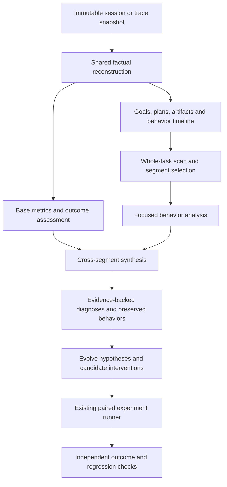

# Behavior Evaluation and Evolution Design

[中文版](2026-10-08-behavior-evaluation-evolution-design.zh-CN.md)

Date: 2026-10-08  
Status: Approved design; initial opt-in implementation is available. Human calibration and default rollout remain pending. See [usage and implementation limits](../../behavior-evaluation-v3.md).  
Scope: Base evaluation, behavioral deep evaluation, and evidence-backed evolution inputs for persistent sessions and offline traces.

## 1. Purpose and decisions

Loom should explain what a task achieved, how the agent pursued it, and which specific changes could improve that behavior.

| Layer           | Responsibility                                                                                               | Output                                                                                |
| --------------- | ------------------------------------------------------------------------------------------------------------ | ------------------------------------------------------------------------------------- |
| Base evaluation | Account for execution and assess deliverables against the effective requirements.                            | Metrics, evidence quality, criterion verdicts, and outcome.                           |
| Deep evaluation | Explain intent alignment, plan quality, progress, investigation efficiency, and adaptation across decisions. | Evidence-backed behavior assessments and causal hypotheses.                           |
| Evolve          | Turn supported patterns into interventions and test their predicted effects.                                 | Proposed changes, experiment specifications, paired results, and preserved behaviors. |

Key decisions:

1. Reuse the immutable evidence store, episode reconstruction, token accounting, and existing experiment infrastructure.
2. Introduce explicit goal revisions, plan versions, artifact versions, and a behavioral state graph.
3. Analyze complete task overviews before selecting deeper investigations; prioritize meaningful segments over fixed model-call batches.
4. Keep observed facts, declared intentions, inferred behavior, and causal hypotheses distinct.
5. Carry validated evidence packets into synthesis, retaining local findings and avoiding unnecessary source rereads.
6. Publish a v3 evaluation contract. Keep v1/v2 interpretable under their original schemas.
7. Separate task outcomes from behavior quality. A successful result may involve an inefficient path; justified exploration can end without success.
8. Evaluate recorded decisions, actions, evidence use, and outcomes. Private reasoning is neither required nor treated as an authoritative account of causality.

This implementation does not require every task to produce a formal plan or a root-cause analysis. Applicability depends on the task. Running an evaluator never replays commands from the analyzed trace. Experiments execute tasks through the existing controlled experiment path.

## 2. Current implementation and gaps

The Web service uses v2 factual reconstruction and `judge_effectiveness`. The existing optimization seed path still consumes v1 evaluation/evolution bundles.

| Current mechanism                                                  | Gap addressed by this design                                                                        |
| ------------------------------------------------------------------ | --------------------------------------------------------------------------------------------------- |
| Five v2 dimensions: context, tools, progress, tokens, verification | Intent alignment and plan quality have no dedicated contracts.                                      |
| Per-model-call pre-state/intent/action/post-state strings          | State changes lack stable facts, hypotheses, problems, and goal/plan links.                         |
| Text-derived task contracts                                        | Natural-language corrections can be missed without explicit goal metadata; origins may overlap.     |
| Consecutive `stalled` grouping                                     | Alternating search/replan/retry cycles can escape detection.                                        |
| First later `blocker_resolution` as recovery candidate             | No explicit link establishes that it resolves the same failure or problem.                          |
| Command verification with unknown artifact binding                 | A passed command cannot establish applicability to the final delivered version.                     |
| Fixed `task_completion=unverified`                                 | Even supported criteria do not yield a computed task outcome.                                       |
| New evidence-review state in each synthesis call                   | Previously supported batch findings can become unknown unless their evidence is read again.         |
| Review count based on row presence                                 | Fully unknown assessments can appear as completed semantic review.                                  |
| v2 proposal grouping by exact mechanism/hypothesis text            | Equivalent behavioral patterns fragment; dimension-to-surface mappings overconstrain interventions. |

The preceding review reproduced the synthesis downgrade and the fixed outcome behavior with deterministic providers. Historical local jobs consumed 705,836 and 1,372,394 evaluator tokens, retaining 6/24 and 8/53 model-call reviews before time exhaustion. These samples motivate cost and coverage work; they are not a calibrated estimate of general diagnostic accuracy. Existing protocol tests establish contract behavior, not model precision.

## 3. Architecture



The service and offline CLI consume the same contracts and analysis functions. Service code owns jobs, budgets, checkpoints, artifact ownership, and transport; it does not implement a second rubric.

Deterministic reconstruction records events and candidate relationships. Model-assisted analysis interprets intent, evaluates semantic plan coverage, connects evidence to hypotheses, and diagnoses patterns. Structural validation proves references and scope, not the truth of every interpretation.

## 4. Identities and scope

Use explicit names for different units:

| Unit                 | Identity and meaning                                                                                                                             |
| -------------------- | ------------------------------------------------------------------------------------------------------------------------------------------------ |
| Session              | Durable conversation and resource binding.                                                                                                       |
| Task episode         | One objective-bearing execution round, including pause/resume attempts. Follow-up tasks form new episodes even if a historical run ID is reused. |
| Run / attempt        | Runtime execution and recovery identity; retained separately from the task episode.                                                              |
| Goal revision        | Effective objective, constraints, and criteria during a bounded event interval.                                                                  |
| Plan revision / node | Recorded plan or workflow state and its stable item IDs.                                                                                         |
| Step                 | Runtime step boundary.                                                                                                                           |
| Model call           | One provider invocation; legacy `round_id` refers to this unit.                                                                                  |
| Behavior segment     | Related decisions addressing a subgoal or problem; can span steps and attempts.                                                                  |

Use recorded source sequence and explicit causal IDs for ordering. Timestamps measure duration when reliable; they do not establish causality. Reuse the session process index's execution-round convention, with an explicit producer ID added for new events. Historical inferred episode boundaries carry their derivation and uncertainty.

Every derived record includes source digest, episode identity, source references, derivation version, and epistemic status. Stable IDs derive from producer identities or canonical source anchors, not natural-language descriptions or judge wording.

## 5. Shared factual contracts

### 5.1 GoalRevision and Criterion

`GoalRevision` records:

- Objective, constraints, deliverables, criteria, and links to the original user messages.
- `accepted_seq`, `effective_from_seq`, `effective_until_seq`, and superseded revision.
- Origin: user instruction, recorded application event, task specification, or evaluator inference.
- Explicit relationships: adds, replaces, clarifies, withdraws; unresolved ambiguity remains visible.

Prefer `task.goal.revised`, `message.created`, `command.applied`, and invocation goal revisions. Add the applied input cursor and message/command IDs to producer events when missing. Acknowledging a message is not proof it was available to the next decision. Actual request evidence separately establishes model visibility.

Natural-language requirement extraction produces inferred criteria with source spans. It cannot silently replace explicit user requirements. Agent-authored goals and final answers are not authoritative revisions. Requirements extracted from different origins retain aliases/provenance instead of being counted twice.

`Criterion` includes stable ID, goal revision, description, requiredness, applicability, expected evidence, and acceptance method. Amendments preserve lineage so evaluations can distinguish a user-authorized scope change from agent drift.

### 5.2 PlanRevision and PlanItem

Record plan/workflow events with revision IDs, stable node IDs, dependencies, status, declared rationale, goal revision, and source spans. Preserve both proposed and accepted changes.

Separate:

- Declared requirement links from evaluator-assessed semantic coverage.
- Claimed completion from artifact or verification evidence.
- Plan validity from plan usefulness.
- A justified revision from repeated wording changes without an actionable change.

No-plan tasks use `not_required` when their scope justifies direct execution; missing historical plan records use `unknown`. Neither receives an automatic penalty.

### 5.3 ModelCall, ToolUse, and ArtifactVersion

Retain current request/response and tool linking, with explicit episode, goal revision, plan node, and operation IDs where recorded. Preserve missing links.

Tool records separate transport/runtime completion, domain outcome, expected negative results, and artifact effects. Normalization is shared by base metrics, deep analysis, and the Web summary.

`ArtifactVersion` records a resource-relative identity, content digest, creation/change event, producing operation, and availability. Report artifacts and workspace report hashes already produced by `create_report` feed this ledger.

Use tool binding effect metadata rather than tool-name matching as the primary source of write attribution. Shell effects remain unknown unless the runtime or a registered verifier captures them.

### 5.4 VerificationObservation and final-version applicability

A verification observation binds:

```text
criterion -> verifier definition/oracle -> input and environment manifest
          -> execution result -> checked artifact versions -> final deliverable versions
```

Capture verifier identity/version, declared scope, actual invocation, assertions or rubric, result, and before/after manifests through the runtime. Reuse existing experiment verifier receipts where available.

A bounded manifest covers declared files and relevant configuration/dependencies. A Git commit alone does not identify uncommitted or untracked content. Hashing a few files does not prove complete test dependency coverage. Unknown external dependencies, concurrent mutation, or incomplete manifests retain an explicit applicability limitation.

Only a verifier adapter with sufficient scope and stable execution inputs can report confirmed applicability. Later relevant writes invalidate that binding; demonstrably unrelated writes do not. Unclassified mutations conservatively make the affected verification unknown. Hashing is bounded and scoped, not a mandatory scan of the entire filesystem on every call.

Offline analysis reads registered snapshots only. New verification execution belongs to an explicit verification job or experiment, with its own provenance and usage.

## 6. Base evaluation

### 6.1 Metrics

Expose totals and per-episode/per-phase breakdowns for:

- Model requests, completed/failed/cancelled/incomplete calls, provider-reported input/output/total tokens.
- Tool attempts, runtime/domain outcomes, schema-defined expected negative results, retries, and unlinked operations. Whether a retry was justified is a deep-evaluation judgment.
- Steps, plan revisions, delivered artifacts, checks, and active criteria.
- Wall time and, where recorded, active execution, provider/tool wait, queue, and human-input wait.
- Missing/conflicting measurements, source gaps, and evaluator usage separately.

Call identities are counted once. Replayed committed results are not new physical executions. Assign each call one primary cost owner; supporting links across segments do not duplicate its cost. Overlapping diagnostic windows are labeled non-additive. Character counts remain distinct from measured tokens.

### 6.2 OutcomeAssessment

Outcome is independent of runtime termination and deep-evaluation coverage.

```json
{
  "runtime_status": "completed",
  "deliverable_status": "present",
  "goal_revision_id": "goal:3",
  "outcome": "partially_verified",
  "criteria": [
    {
      "criterion_id": "criterion:report-written",
      "verdict": "supported",
      "method": "artifact_check",
      "coverage": "complete",
      "applicability": "confirmed",
      "evidence_refs": []
    }
  ],
  "limitations": ["Report claim quality has not been reviewed"]
}
```

This shape is illustrative; a real supported verdict requires valid nonempty evidence references.

Criterion verdicts retain `supported / contradicted / unverified / not_applicable`. Overall outcome uses:

1. `unverified` if the effective goal/requiredness is ambiguous or no applicable required criteria are known.
2. `not_achieved` if an applicable required criterion is demonstrably contradicted.
3. `achieved` if all applicable required criteria are fully supported with valid applicability and the original effective goal is completely covered.
4. `partially_verified` if a subset is supported and remaining required criteria are unverified.
5. Otherwise `unverified`.

A contradiction can still be reported under an ambiguous goal, but does not manufacture a definitive aggregate. Excluding a requirement as not applicable requires a source-grounded rationale. Optional failures remain visible without changing required-goal success.

Keep the complete effective objective as an explicit acceptance obligation alongside decomposed criteria. Track `goal_coverage=complete/partial/unknown`; satisfying an inferred subset cannot establish achieved. For example, a request to construct and run a test is not satisfied merely by running an existing test.

Base mode defaults to deterministic checks. Report existence and source-reference presence are facts; factual correctness, relevance, and synthesis quality may require a separately requested bounded outcome judge. Record its model/rubric and uncertainty. Deep eval consumes this assessment and may propose a revised assessment with provenance; it never silently overwrites a verified base result.

## 7. Behavioral deep evaluation

### 7.1 State graph

Introduce `Problem`, `Hypothesis`, `EvidenceItem`, `Decision`, `BehaviorSegment`, and `BehaviorAssessment`.

- A problem has an observable symptom, scope, goal links, and open/resolved/unknown state.
- A hypothesis has proposed/supported/refuted/unresolved state with evidence-backed transitions.
- An evidence item distinguishes first observation, actual availability in a request, and observed use.
- A decision records the question, chosen action, declared rationale, available evidence, associated hypotheses, and expected observation when recorded.
- A segment references participating calls/steps, boundary reasons, goal/plan versions, incoming/outgoing state, and measured costs.
- An assessment contains dimension, applicability, finding, mechanism, consequence, evidence/counterevidence, confidence basis, alternative explanations, and preservation requirements.

Edges include `tests`, `supports`, `refutes`, `uses`, `changes`, `verifies`, and `resolves`. Each edge identifies whether it is explicitly recorded, deterministically linked, or inferred. A temporal successor is not automatically a causal resolution.

Do not require the agent to verbalize every hypothesis or rationale. Missing declarations are unknown; recorded actions can support limited behavioral inference. Judge-generated labels are never inserted back into the solver trace as observed facts.

### 7.2 Primary dimensions

| Dimension                  | Questions and acceptance evidence                                                                                                                        |
| -------------------------- | -------------------------------------------------------------------------------------------------------------------------------------------------------- |
| `intent_alignment`         | Did the agent respect the effective objective, constraints, deliverables, and applied user corrections? Was clarification necessary and used?            |
| `plan_quality`             | Did the plan cover requirements, order dependencies, test risky assumptions, and define meaningful verification? Were changes supported by new evidence? |
| `progress_effectiveness`   | What facts, hypotheses, artifacts, or verification state changed? Did apparently different steps repeat the same unresolved state?                       |
| `investigation_efficiency` | Were checks discriminative and evidence adopted promptly? How much work preceded identification, intervention, and confirmation?                         |
| `adaptation_recovery`      | Did contradictions/failures change strategy? Was the same problem resolved, and were retries proportionate to new conditions?                            |

Retain context, tool, token, and verification analysis as supporting lenses. Preserve legacy v2 assessments verbatim in their versioned representation; they are not automatically reclassified into the new dimensions.

Dimension judgments use `effective / ineffective / mixed / unknown / not_applicable`, with explicit reasons and evidence. There is no arithmetic overall behavior score.

### 7.3 Patterns and efficiency measures

Candidate patterns include unchanged-result retries, search/replan cycles, reopening refuted hypotheses without new evidence, ignored discriminative evidence, plan churn, premature closure, and unrelated investigation drift.

Cheap detectors nominate windows; a judge checks goal relevance, changed inputs/environment, counterevidence, and reasonable alternatives. Valid negative results, recovery probes, and rereading changed files can be useful.

Compute evidence-bound measures only when endpoints are identified:

| Measure                         | Definition                                                                                      |
| ------------------------------- | ----------------------------------------------------------------------------------------------- |
| Cost to discriminative evidence | Calls/tokens from problem opening to the first evidence that distinguishes relevant hypotheses. |
| Evidence adoption lag           | Decisions/cost from evidence actually becoming available to its first supported use.            |
| Cost to supported cause         | Calls/tokens before a cause has adequate support; an agent's assertion alone is insufficient.   |
| Cause-to-verification cost      | Work between supported cause, intervention, and meaningful validation.                          |
| Redundant segment cost          | Measured cost of a specifically diagnosed avoidable segment, with uncertainty.                  |
| Recovery cost                   | Cost tied to one problem/failure and its evidence-backed resolution.                            |
| Plan response lag               | Delay between an applied requirement or relevant finding and a necessary plan change.           |

Parallel work uses recorded dependencies and separate latency/cost accounting. Pause and human wait are not reasoning delay. Without recorded evidence adoption, lag remains unknown. Research tasks can measure cost to sufficient source coverage or resolution of conflicting claims; root-cause metrics can be not applicable.

A shorter hypothetical path is a proposal, not measured savings. Evaluate choices using information available at the decision time, then evaluate consequences with later evidence.

## 8. Analysis execution and evidence efficiency

### 8.1 Stages

1. **Reconstruct:** build factual ledgers and data-quality diagnostics deterministically.
2. **Scan:** show the full selected episode's compact goals, plan changes, outcomes, errors, evidence arrivals, and cost distribution. Identify boundaries and candidate issues.
3. **Focus:** analyze selected behavior segments with predecessor/successor context and targeted source access. Include successful comparison segments, not only failures.
4. **Synthesize:** connect findings across segments, examine alternative explanations, and retain unresolved coverage.
5. **Propose:** convert supported diagnoses into Evolve hypotheses.

Large scans use hierarchical summaries with complete navigable indexes. A scope limit does not silently select only the first N calls. New scopes can target an episode, goal revision, or segment; omitted regions are explicit. Legacy `max_rounds` prefix semantics remain only on v2.

Segmentation and prioritization are checkpointed and versioned. Unreviewed segments are not classified as effective. Synthesis cannot rewrite validated local assessments silently; a revision cites new evidence, retains the previous assessment, and invalidates dependent conclusions when necessary.

### 8.2 EvidencePacket and Claim lineage

An evidence packet carries bounded exact source excerpts, their returned ranges/digests, associated factual records, and validated claim IDs. A claim stores supporting and opposing leaf evidence, source scope, producer stage, epistemic status, and limitations.

When synthesizing:

- Deliver the minimal original excerpts needed for inherited findings.
- Preserve local validated assessments even if synthesis cannot finish.
- Label inherited interpretations as interpretations, not raw facts.
- Validate new cross-segment claims against delivered evidence and claim lineage.
- Expand source evidence for contradictions or stronger conclusions; a summary reference never licenses an unread absence claim.

The reviewed-range tracker remains local to evidence actually delivered in each call. Do not simply mark all previously read text as visible to a new model call. Reuse immutable excerpt material and validated lineage instead.

### 8.3 Budgets and checkpointing

Use a dedicated evaluator model alias/configuration. Resolve stage output limits and supported reasoning settings before calls; include effective values in cache identity. Provider-specific options are validated through the existing adapter.

Initial configurable defaults proposed for v3:

- Scan: 15% of call/token/evidence budget.
- Focus: 60%.
- Synthesis: reserved 20%.
- Protocol correction: at most 5%, with at most one repair per failed response.
- Response output cap: 4,096 tokens for scan/focus and 8,192 for synthesis, further bounded by remaining budget and provider support.

These are engineering starting points subject to calibration, not proven optimal values. Corrections are charged within stage and total budgets. A model requiring a larger reasoning allocation uses an explicit evaluation profile rather than silently inheriting a solver's large output cap.

Reserve synthesis capacity before admitting another focus call. Limit evidence reads to specific needs, cache immutable excerpts, and avoid repeatedly serializing complete contexts. Token budgets remain admission thresholds when the provider cannot enforce a combined prompt/output cap; report overshoot and missing usage accurately.

A checkpoint includes source/scope, resolved goal and segment graph, stage tasks, evidence packets, claims, finished outputs, effective model/rubric versions, and cumulative usage. Resume preserves immutable analysis settings; increasing resource limits continues the same job without repeating completed calls. Changed snapshot, semantics, segmentation policy, or model configuration starts a new evaluation.

## 9. Coverage and presentation

Expose separate measures:

- Source completeness and linked-call coverage.
- Regions selected for review versus the requested scope.
- Assessment attempted versus evidence-supported judgments, per dimension.
- Evidence delivered and unresolved gaps.
- Whole-task scan and synthesis completion.
- Outcome verification coverage.
- Evaluator calls/tokens/time, repairs, unknown rate, and incremental cost of supported findings.

A row containing only unknown judgments is attempted, not a supported review. A returned analysis artifact can be operationally completed with partial semantic coverage. A valid criterion outcome does not become unknown just because an unrelated behavioral segment was not reviewed.

Base UI shows metrics, deliverables, criteria, and outcome. Deep UI starts with the goal/plan/problem timeline and highest-impact findings, then segment evidence and costs. It distinguishes facts, judgments, causal hypotheses, and proposed improvements. Display evidence-to-decision links and applied user revisions; keep raw model/tool views accessible.

## 10. Evolve integration

Publish `loom.evolution.hypotheses.v2` with:

- Stable `pattern_type`, affected problem/goal/segment IDs, occurrence evidence, and task coverage.
- Mechanism, alternative explanations, epistemic status, and conditions of applicability.
- Candidate intervention surfaces selected from the mechanism, including runtime, tools, context, prompts, planning policy, or provider configuration.
- Expected directional change, measurable endpoint, preserved behaviors, and possible regressions.
- A concrete validation plan with baseline/candidate, frozen task/environment/evaluator identities, repetitions, failure criteria, and budget.

Pattern taxonomy is versioned. Text similarity can suggest consolidation, but merging requires equivalent mechanisms and keeps provenance. Count independent episodes/tasks separately from repeated occurrences within one episode. A severe single occurrence can motivate investigation; repeated wording is not independent corroboration.

Separate `proposed -> ready_for_experiment -> tested -> supported/rejected/inconclusive`. Promotion remains the responsibility of existing governance. Unknown or merely causal-hypothesis findings can remain exploratory proposals but cannot be presented as established improvements.

Wire v3 inputs explicitly into `optimize/runtime.py` and the existing paired experiment runner. Do not translate behavior judgments into invented v1 quality scores. Extend experiment metrics through typed, versioned objectives, preserving evaluator identity and unknown/missing-data handling.

Quality constraints come first: required outcome, evidence/verification coverage, and preserved behaviors must satisfy the declared regression criteria. Then compare solver calls/tokens, task-relevant latency, and behavioral endpoints. Freeze non-inferiority tolerances and primary endpoints before trials; report valid/missing pairs and intervals. A smaller token count with skipped verification is not an accepted improvement.

The same source snapshot can motivate multiple interventions: repeated reading caused by tool truncation requires a different change from repeated reading caused by lost context. Experiments test the mechanism, not just the symptom label.

## 11. Versioning, APIs, and compatibility

The v3 manifest uses `loom.evaluation.bundle.v3`, with separate artifacts for goals, plans, problems/hypotheses, decisions, segments, artifact versions, verification observations, metrics, outcomes, assessments, diagnoses, claims/evidence packets, coverage, and evaluator usage. Hash all artifact references and record derivation/rubric/model/configuration versions.

Keep v1/v2 readers and saved artifacts unchanged. Adapters can import their facts and preserve their findings as legacy assessments. Missing goal application boundaries or artifact bindings remain unknown; historical traces are not silently upgraded into fully verified results.

Add explicit `analysis_version: "v3"` and scope to trajectory/deep-evaluation requests, and `--analysis-version v3` to the offline CLI. Expand request validation rather than bypassing it. Existing empty-body trajectory requests and v2 clients keep their behavior until the rollout gate. Outcome judging is an explicit option/job and has separately visible usage.

The Web catalog advertises supported versions and capabilities. Response envelopes identify schema versions; incompatible clients get an actionable error or a supported legacy view. No new artifact is parsed solely by filename or assumed to be v1.

Cache keys include source snapshot, requested scope, evidence/segmentation policy, schema/rubric versions, effective evaluator settings, and stage plan. Saved v2 checkpoints are readable but not executable as v3 checkpoints. New evaluator schema/interpretation requires a new cache namespace.

## 12. Implementation sequence and exit criteria

| Phase                                | Work and principal modules                                                                                                                                                                          | Exit criterion                                                                                                                                  |
| ------------------------------------ | --------------------------------------------------------------------------------------------------------------------------------------------------------------------------------------------------- | ----------------------------------------------------------------------------------------------------------------------------------------------- |
| P0: Contracts and reference fixtures | Add v3 contracts under `evaluation`; fixed goal/plan/behavior fixtures and migration readers.                                                                                                       | Identity, provenance, verdict, applicability, and unknown semantics are unambiguous and tested.                                                 |
| P1: Facts and Base eval              | Extend `service/store.py`, `controller.py`, invocation metadata, `tasks/assembly.py`, `evaluation/trajectory.py`, and verification capture; add goal/plan/artifact ledgers and outcome aggregation. | Follow-ups and applied corrections are scoped correctly; base metrics agree with physical calls; valid bound verification can produce achieved. |
| P2: Behavioral analysis              | Add proposed `behavior_graph.py`, `segmentation.py`, `behavior_judge.py`, and `evidence_packets.py`; retain shared evidence access.                                                                 | Cross-step cycles, plan omissions, evidence adoption, and causal recovery pass positive and negative fixtures.                                  |
| P3: Service and UI                   | Extend `service/semantic.py`, `insights.py`, and trajectory/evaluation views; share orchestration with offline analysis.                                                                            | Partial coverage, budget reservation, cancellation, restart/resume, and version negotiation work end to end.                                    |
| P4: Evolve and trials                | Extend `evolution/diagnoses.py`, versioned bundle consumers, `optimize/runtime.py`, and existing campaign experiments.                                                                              | A v3 diagnosis produces a specific intervention experiment with frozen outcome/regression criteria and evidence lineage.                        |
| P5: Calibration and rollout          | Run the reviewed benchmark, compare v2/v3 cost and diagnostic precision, update public docs.                                                                                                        | Quality/cost gates pass; then make v3 the default for new supported UI/CLI entry points.                                                        |

Ship phases in separate reviewable changes. P1 exposes useful base results before deep analysis is complete. P2/P3 remain opt-in while calibration proceeds. Existing Python v1 compatibility defaults are migrated only with explicit consumer changes; old jobs and experiments remain reproducible.

Suggested new modules are implementation boundaries, not a requirement to create one file per record type.

## 13. Validation and acceptance

### Deterministic contracts and lifecycle

Cover at least:

1. A natural-language correction applies mid-run; earlier decisions are judged against the earlier goal.
2. A follow-up reuses a run ID but belongs to a new task episode.
3. A plan is accepted by the runtime yet omits a required deliverable.
4. A simple task completes correctly without a formal plan.
5. Repeated search/replan cycles make no relevant state change.
6. A negative search eliminates a hypothesis; a retry after changed conditions is justified.
7. Evidence existed earlier but entered the model context later.
8. An unrelated later blocker resolution does not close the original problem.
9. Root-cause assertion, supporting experiment, fix, and validation occur at different points.
10. A test passes before a related file changes; an unrelated file change does not invalidate a proven bounded scope.
11. A report exists with citations but its claim quality remains unreviewed.
12. Synthesis retains local findings and receives their exact source ranges without reading entire repeated contexts.
13. All-unknown assessments cannot be reported as supported coverage.
14. Missing/duplicate/replayed calls do not fabricate complete token totals or duplicate execution cost.
15. Budget exhaustion, cancellation, and restart retain completed stage work and cumulative evaluator usage.
16. A candidate saves tokens by omitting required verification and is rejected by experiment quality criteria.

### Semantic calibration

Create a versioned corpus of at least 30 episodes across coding/debugging, research, and general tasks, including successful controls and incomplete records. Use at least two independent human reviews with adjudication of disagreements. Separate prompt-development cases from held-out validation cases.

Initial rollout gates, to be frozen before evaluating the held-out set:

- At least 90% precision for actionable negative diagnoses; at least 80% recall for annotated intent/plan/cycle/evidence-adoption failures, reported by category.
- No more than 10% false-positive rate on justified retries, useful negative results, and reasonable exploration.
- Every actionable diagnosis has resolving, correctly scoped evidence; no fabricated decisive evidence or unsupported achieved verdict in the reference corpus.
- At least 90% agreement with adjudicated criterion verdicts on cases with sufficient recorded evidence; abstentions count against coverage, not as correct verdicts.
- Repeated judge runs report stability and disagreements; thresholds are not interpreted as calibrated confidence.
- At comparable supported coverage, median evaluator token use at least 50% below v2 on the same fixtures, without breaching quality gates. Report p90 cost, wall time, and failures separately; report absolute cost for tasks where v2 cannot finish.

Report raw counts and uncertainty because a small corpus yields imprecise rate estimates. Category/sample coverage must be sufficient before claiming its gate passed. Thresholds are engineering acceptance targets, not results already achieved; changing them after seeing held-out outcomes requires a new validation split and documented rationale.

## 14. References

- [Current trace analysis](../../trace-effectiveness-analysis.md)
- [Current session trajectory and deep evaluation](../../session-trajectory-analysis.md)
- [Earlier evaluation review](../../session-trajectory-evaluation-review.md)
- [v2 design](2026-09-05-trace-effectiveness-analysis-design.md)
- [Historical model validation](../../analysis/2026-09-05-trace-effectiveness-validation.md)
- [Existing experiment contracts](../../../src/loom/evaluation/experiments.py)
- [Existing paired experiment runner](../../../src/loom/campaigns/experiments.py)
