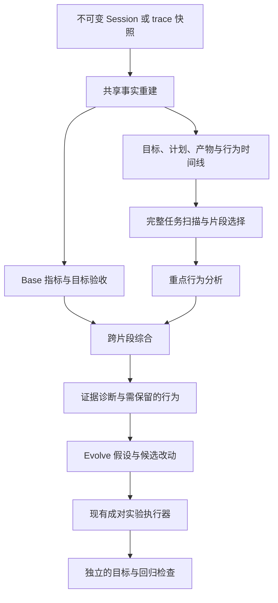

# 行为评估与演进设计

[English version](2026-10-08-behavior-evaluation-evolution-design.md)

日期：2026-10-08  
状态：设计已批准，首版实现可显式启用；人工校准及默认切换尚未完成。参见[使用方法与当前限制](../../behavior-evaluation-v3.zh-CN.md)。  
范围：持久 Session 和离线 trace 的 Base Evaluation、行为 Deep Evaluation，以及有证据支持的 Evolve 输入。

## 1. 目标与主要决策

Loom 应能说明任务达成了什么、Agent 如何推进任务，以及哪些具体改动可能改善这种行为。

| 层次            | 职责                                                         | 产物                                            |
| --------------- | ------------------------------------------------------------ | ----------------------------------------------- |
| Base evaluation | 统计执行事实，按生效要求检查交付物。                         | Metrics、证据质量、逐项验收结论、目标达成状态。 |
| Deep evaluation | 跨决策分析意图对齐、计划质量、推进效果、调查效率和策略调整。 | 有证据支持的行为评估与原因假设。                |
| Evolve          | 将有依据的行为模式转成改进措施，并检验预期效果。             | 修改建议、实验定义、成对结果、需保留的行为。    |

主要决策：

1. 复用现有不可变证据存储、episode 重建、token 账本与实验基础设施。
2. 引入明确的目标修订、计划版本、产物版本与行为状态图。
3. 先查看完整任务概况，再选择深入分析的位置；以有意义的行为片段为主要单位。
4. 区分记录事实、声明意图、行为推断和因果假设。
5. 综合阶段携带经过校验的证据包，保留局部结论，减少重复回读。
6. 发布 v3 evaluation 契约；v1/v2 继续按照原有 schema 解释。
7. 目标达成与行为质量分别评价：成功任务也可能路径低效，合理探索也可能没有解决问题。
8. 推理效率通过已记录的决策、行动、证据利用和结果评价；不要求获得模型私有思考过程，也不将自述推理当作因果真相。

不要求所有任务都生成正式计划或进行根因分析，是否适用取决于任务。
运行评估器不重放 trace 中的命令；实验通过现有受控实验路径执行任务。

## 2. 当前实现与差距

Web 服务已经接入 v2 事实重建和 `judge_effectiveness`。
现有 optimize 的 seed evaluation/evolution 仍消费 v1 bundle。

| 当前机制                                               | 本设计解决的缺口                                           |
| ------------------------------------------------------ | ---------------------------------------------------------- |
| context、tool、progress、token、verification 五维评估  | 意图对齐与计划质量缺少独立契约。                           |
| 每次模型调用的 pre-state/intent/action/post-state 文本 | 缺少稳定的事实、假设、问题，以及目标和计划关联。           |
| 从文本恢复 task contract                               | 缺少显式元数据时可能遗漏自然语言修正；不同来源可能重复。   |
| 拼接连续 `stalled` 轮次                                | 搜索、重规划、重试交替发生的循环可能漏检。                 |
| 将之后第一个 `blocker_resolution` 作为恢复候选         | 无法明确证明它解决的是原来的问题。                         |
| 验证结果缺少产物绑定                                   | 命令通过不能证明最终交付版本适用。                         |
| `task_completion` 固定为 unverified                    | 已有支持证据的验收项无法汇总为目标达成状态。               |
| 综合阶段重新建立证据阅读状态                           | 已有支持的批次诊断可能因未再次回读而降为 unknown。         |
| 按评审记录数量计算覆盖                                 | 全部 unknown 的记录也可能计入已评审。                      |
| 按机制、建议文本精确分组                               | 同一种行为模式容易被拆散；固定维度到修改面的映射过于粗糙。 |

前次审查使用确定性 provider 复现了综合阶段证据降级和目标状态固定的问题。
本地历史任务分别消耗 705,836 和 1,372,394 个 evaluator token，
在时间耗尽前留下 6/24 和 8/53 轮评审。这些样本说明成本与覆盖需要改进，
不代表已经估计出总体诊断精度。现有协议测试验证契约行为，不等同于模型判断准确。

## 3. 总体架构



服务和离线 CLI 使用相同契约及分析函数。
服务层负责 job、预算、checkpoint、artifact 归属与传输，不维护另一套 rubric。

确定性重建记录事件和候选关联。
模型负责解释意图、判断计划语义覆盖、关联证据与假设、诊断行为模式。
结构校验可以证明引用和作用域正确，不能证明每条解释在语义上正确。

## 4. 身份与作用域

| 单位                 | 身份与含义                                                                                           |
| -------------------- | ---------------------------------------------------------------------------------------------------- |
| Session              | 持久对话和资源绑定。                                                                                 |
| Task episode         | 一个目标对应的执行轮次，包含 pause/resume 尝试；历史 run ID 被复用时，后续新任务仍属于新的 episode。 |
| Run / attempt        | 执行与恢复身份，独立于 task episode 保存。                                                           |
| Goal revision        | 在某个事件区间生效的目标、约束和验收要求。                                                           |
| Plan revision / node | 已记录的计划或工作流版本及稳定节点 ID。                                                              |
| Step                 | 运行时 step 边界。                                                                                   |
| Model call           | 一次 provider 调用；旧 `round_id` 对应这一单位。                                                     |
| Behavior segment     | 围绕同一子目标或问题的决策片段，可以跨 step 和 attempt。                                             |

使用源记录顺序和显式因果 ID 确定关系，可靠时间戳用于计算耗时，不单独证明因果。
复用 Session process index 的执行轮次约定，并为新事件增加显式 producer ID。
历史边界推断必须携带依据与不确定性。

每个派生记录包含源摘要、episode 身份、证据引用、派生版本和认识状态。
稳定 ID 来自生产者身份或规范化源位置，不依赖 judge 措辞。

## 5. 共享事实契约

### 5.1 GoalRevision 与 Criterion

`GoalRevision` 包含：

- 目标、约束、交付物、验收项及原始用户消息引用。
- `accepted_seq`、`effective_from_seq`、`effective_until_seq` 和被替代版本。
- 来源：用户指令、已记录的应用事件、任务配置，或 evaluator 推断。
- adds、replaces、clarifies、withdraws 等明确关系；歧义保持可见。

优先使用 `task.goal.revised`、`message.created`、`command.applied`
和 Invocation 中的 goal revision。
缺少时，在事件生产端补充已应用的输入 cursor 和 message/command ID。
消息被接收不代表已进入下一次决策；模型可见性由实际请求证据单独证明。

自然语言抽取结果作为带原文范围的推断要求，不能悄悄替换用户明确要求。
Agent 自己写的目标和最终回答不是权威修订。
不同来源的同一要求记录别名和来源关系，避免重复计数。

`Criterion` 包含稳定 ID、目标版本、描述、是否必需、适用性、期望证据和验收方式。
修订保留沿革，以区分用户允许的范围变化和 Agent 自行偏离。

### 5.2 PlanRevision 与 PlanItem

记录 plan/workflow 事件中的版本、稳定节点 ID、依赖、状态、声明原因、
目标版本和源引用，同时保留提出与接受的修改。

分别表达：

- Agent 声明的要求映射与 evaluator 判断的语义覆盖。
- 声称完成与实际产物/验证证据。
- 计划结构合法与计划是否有用。
- 基于新证据的调整与没有行动变化的措辞修改。

简单任务可以标记计划 `not_required`；
历史计划记录缺失标记 `unknown`，均不自动扣分。

### 5.3 ModelCall、ToolUse 与 ArtifactVersion

保留现有请求、响应和工具关联，补充已记录的 episode、目标版本、
计划节点和 operation ID；缺失关联不补造。

工具记录区分 transport/runtime 完成、领域结果、预期负结果和产物副作用。
Base、Deep 和 Web 汇总使用同一套标准化结果。

`ArtifactVersion` 保存资源相对身份、内容摘要、创建/修改事件、
生产 operation 和可用性。`create_report` 已产生的报告 artifact
和 workspace 文档 hash 进入该账本。

副作用归属以 ToolBinding 的 effect metadata 为主要依据；
工具名称匹配仅作历史兼容线索。
Shell 修改只有在 runtime 或注册 verifier 捕获后才能确认，否则保持 unknown。

### 5.4 VerificationObservation 与最终版本适用性

验证观察建立以下关联：

```text
验收要求 -> verifier 定义/oracle -> 输入与环境 manifest
         -> 执行结果 -> 被检查的产物版本 -> 最终交付版本
```

通过运行时记录 verifier 身份/版本、声明范围、实际调用、断言或 rubric、
结果及执行前后 manifest；可以复用已有实验 verifier receipt。

有界 manifest 覆盖声明文件及相关配置/依赖。
Git commit 不包含未提交和未跟踪内容；少量文件 hash 不能证明完整测试依赖范围。
外部依赖未知、并发修改或 manifest 不完整时，明确保留适用性限制。

只有范围足够、执行输入稳定的 verifier adapter 才能声明 confirmed。
之后的相关修改使绑定失效；能够证明无关的修改不使它失效。
无法分类的修改使受影响验证保守地转为 unknown。
Hash 捕获按声明范围限额执行，不要求每次调用扫描整个文件系统。

离线分析仅读取已注册快照。新增验证执行属于显式 verification job 或实验，
具有独立的来源和用量记录。

## 6. Base evaluation

### 6.1 Metrics

提供总量及按 episode/阶段细分的数据：

- 模型请求数、完成/失败/取消/未完成数，provider 报告的输入/输出/总 token。
- 工具尝试、runtime/domain 结果、工具 schema 定义的预期负结果、重试和无法关联的 operation；重试是否合理由 Deep 判断。
- Step、计划修订、交付物、验证检查及有效验收项。
- 墙钟时间，以及可测量的活跃执行、模型/工具等待、排队、人工输入等待时间。
- 缺失/冲突测量、源记录缺口，以及单独统计的 evaluator 用量。

同一调用只计数一次，重放已提交结果不等于重新物理执行。
每次调用只有一个主要成本归属；跨片段支持关系不重复计费。
重叠诊断窗口标记不可直接相加。字符数与实测 token 分开。

### 6.2 OutcomeAssessment

目标状态独立于运行时是否结束，也独立于 Deep Eval 是否覆盖全部行为。

```json
{
  "runtime_status": "completed",
  "deliverable_status": "present",
  "goal_revision_id": "goal:3",
  "outcome": "partially_verified",
  "criteria": [
    {
      "criterion_id": "criterion:report-written",
      "verdict": "supported",
      "method": "artifact_check",
      "coverage": "complete",
      "applicability": "confirmed",
      "evidence_refs": []
    }
  ],
  "limitations": ["报告内容质量尚未评审"]
}
```

这是结构示意；真实 supported 结论必须具有有效且非空的证据引用。

逐项 verdict 保留 `supported / contradicted / unverified / not_applicable`。
整体 outcome 按以下顺序计算：

1. 有效目标或 requiredness 存在歧义，或没有已知适用必需项：`unverified`。
2. 任一适用必需项被证据明确反驳：`not_achieved`。
3. 所有适用必需项均被完整支持、适用性成立，且完整覆盖原始生效目标：`achieved`。
4. 部分已被支持，其余必需项未验证：`partially_verified`。
5. 其他情况：`unverified`。

目标有歧义时仍展示具体反证，但不制造确定的整体判断。
排除某项为不适用必须有来源依据。
可选项失败保留展示，不改变必需目标的达成结论。

在拆分验收项之外，保留完整生效目标作为显式验收义务，
记录 `goal_coverage=complete/partial/unknown`。
满足推断出的部分要求不能得到 achieved，例如要求“构建并运行测试”时，
仅运行已有测试不满足完整目标。

Base 默认执行确定性检查。
报告存在、引用存在属于事实；事实准确性、相关性和综合质量可能需要单独请求的
有预算限制的 outcome judge，并记录其模型、rubric 和不确定性。
Deep 消费这一结果；如发现新证据，可以产生有来源的新版本，
不能静默覆盖已经验证的 Base 结果。

## 7. 行为 Deep evaluation

### 7.1 行为状态图

增加 `Problem`、`Hypothesis`、`EvidenceItem`、`Decision`、
`BehaviorSegment` 和 `BehaviorAssessment`：

- Problem：可观察症状、范围、目标关联、open/resolved/unknown 状态。
- Hypothesis：proposed/supported/refuted/unresolved 状态及证据支撑的变化。
- EvidenceItem：首次产生、实际进入请求、被观察到使用的不同时间。
- Decision：当前问题、选定行动、声明理由、可用证据、关联假设，
  以及确有记录时的预期观察。
- BehaviorSegment：参与的调用/step、边界原因、目标/计划版本、
  进入和离开时的状态、实测成本。
- BehaviorAssessment：维度、适用性、发现、机制、后果、
  证据/反证、置信依据、替代解释及保留要求。

关系包括 `tests`、`supports`、`refutes`、`uses`、`changes`、
`verifies`、`resolves`。
每条关系注明显式记录、确定性关联或推断，时间上的后继不自动成为因果上的解决。

不要求 Agent 口述全部假设和理由；缺少声明时保留 unknown，
可以从记录行动得到有限推断。Judge 标签不回写为 solver trace 的原始事实。

### 7.2 主要维度

| 维度                       | 问题与验收依据                                                                       |
| -------------------------- | ------------------------------------------------------------------------------------ |
| `intent_alignment`         | 是否遵守生效目标、约束、交付要求和已应用的用户修正？澄清是否必要并被采纳？           |
| `plan_quality`             | 是否覆盖要求、安排合理依赖、优先检查高风险假设、定义有效验证？修订是否有新证据支持？ |
| `progress_effectiveness`   | 事实、假设、产物或验证状态改变了什么？不同动作是否回到同一未解决状态？               |
| `investigation_efficiency` | 检查能否区分假设？证据是否及时采纳？定位、干预、确认前各花了多少工作？               |
| `adaptation_recovery`      | 遇到反证/失败后是否改变策略？是否解决同一问题？重试是否与条件变化相称？              |

Context、tool、token、verification 分析保留为支撑视角。
v2 结果按照原版本保留，不自动重新解释成新维度。

维度状态为 `effective / ineffective / mixed / unknown / not_applicable`，
必须给出原因和证据，不计算算术平均的行为总分。

### 7.3 行为模式与效率指标

候选模式包括：结果不变的重试、搜索/重规划循环、
没有新证据却重启已否定假设、忽略关键证据、计划反复改写、
过早结束和无关调查漂移。

低成本检测器只提名分析窗口。
Judge 检查目标相关性、输入/环境变化、反证和合理替代解释。
有效负结果、恢复探测、读取已变化文件都可能是有益行为。

仅在起止事件得到支持时计算指标：

| 指标                 | 定义                                                         |
| -------------------- | ------------------------------------------------------------ |
| 获得区分性证据的成本 | 从问题出现到首次获得能区分相关假设的证据，消耗的调用/token。 |
| 证据采纳延迟         | 从证据实际可用到首次有依据的利用之间的决策数和成本。         |
| 定位有支持原因的成本 | 原因得到足够证据支持之前的调用/token；Agent 自述不构成支持。 |
| 原因到验证的成本     | 有支持的原因、干预和有效验证之间的工作。                     |
| 冗余片段成本         | 特定可避免片段的实测成本及不确定性。                         |
| 恢复成本             | 与同一个问题/失败及其有证据支持的解决相关的成本。            |
| 计划响应延迟         | 已生效要求或相关发现出现后，必要计划修改的延迟。             |

并发工作按记录依赖区分耗时与成本，暂停和人工等待不计为推理迟缓。
没有记录到证据采纳时，延迟保持 unknown。
Research 可以改用达到足够来源覆盖、解决冲突主张的成本；
根因指标可以不适用。

更短的假想路径属于建议，不是已经测量的节省。
使用决策时可得信息评价选择，用之后的证据评价实际后果。

## 8. 分析执行与证据效率

### 8.1 执行阶段

1. **Reconstruct**：确定性生成事实账本和数据质量诊断。
2. **Scan**：展示所选完整 episode 的目标、计划变化、结果、
   错误、证据到达和成本分布，识别边界及候选问题。
3. **Focus**：带上前后状态，对重点行为片段定向取证；
   同时纳入成功对照片段。
4. **Synthesize**：关联跨片段发现，检查替代解释，保留覆盖缺口。
5. **Propose**：将有依据的诊断转成 Evolve 假设。

大型扫描采用分层摘要和完整可导航索引。
范围限制不能静默变成只看前 N 次调用。
新范围支持 episode、目标版本或片段；遗漏区域明确展示。
旧 `max_rounds` 的前缀语义只保留在 v2。

切片和优先级决策进入 checkpoint 并版本化。
未评审片段不能标成有效。
综合阶段修改已验证局部结论时，必须引用新证据、
保留原结论，并按需使依赖结论失效。

### 8.2 EvidencePacket 与 Claim 来源关系

证据包携带有界原文摘录、实际返回范围/摘要、事实记录和经过校验的 claim ID。
Claim 保存支持与反对的原始证据、来源范围、生产阶段、认识状态和限制。

综合阶段：

- 携带继承结论所需的最小原文片段。
- 即使综合未完成，也保留局部有效评估。
- 将继承解释标记为解释，不能变成原始事实。
- 依据实际交付证据和 claim 来源关系，验证新增跨片段结论。
- 对矛盾或更强结论展开原文；摘要引用不能支持针对未读文本的缺失断言。

阅读范围校验器继续只认可当前调用实际收到的证据。
不能将以前读过的全部文本直接标成新调用已读；
应复用不可变摘录和可追溯的结论来源。

### 8.3 预算与 checkpoint

使用独立 evaluator 模型别名/配置，在调用前解析阶段输出上限和供应商支持的
reasoning 参数，实际配置纳入缓存身份，并通过现有适配器校验。

v3 建议的初始可配置分配：

- Scan：调用/token/证据预算的 15%。
- Focus：60%。
- Synthesis：预留 20%。
- 协议纠正：最多 5%，每个失败响应最多修复一次。
- 输出上限：scan/focus 4,096 token，synthesis 8,192 token；
  同时受剩余预算和 provider 支持约束。

这些是待校准的工程初值，不是已证明最优的参数。
纠正同时计入阶段和总预算。
需要更大 reasoning 空间的模型使用明确的 evaluation profile，
不静默继承 solver 的大输出上限。

开始下一次 focus 前必须保留综合预算。
证据回读针对明确需求，缓存不可变摘录，避免重复序列化完整上下文。
Provider 无法严格限制输入加输出总量时，token 预算是准入阈值，
必须准确记录超出和 usage 缺失。

Checkpoint 包含 source/scope、目标和片段图、阶段任务、证据包、claims、
已完成输出、实际模型/rubric 版本及累计用量。
Resume 保持不可变分析设置；增加资源上限可继续同一 job，复用已完成调用。
快照、语义、切片策略或模型配置变化时，新建 evaluation。

## 9. 覆盖率与页面展示

分别展示：

- 源记录完整度与调用关联覆盖。
- 请求范围中实际选中评审的区域。
- 每个维度尝试评审与得到证据支持的判断数量。
- 已交付证据与未解决缺口。
- 整体扫描、综合是否完成。
- 目标验收覆盖。
- Evaluator 调用/token/耗时、修复次数、unknown 比例和有效结论的增量成本。

全部 unknown 的记录只算尝试评审，不算有支持的判断。
Job 可以正常产出结果，而语义覆盖仍是 partial。
某个无关行为片段未评审，不应使原本有效的验收结论退化为 unknown。

Base 页面展示 metrics、交付物、验收项和目标状态。
Deep 页面优先展示目标/计划/问题时间线及影响最大的发现，
再展开片段证据和成本，区分事实、判断、因果假设和建议。
可追踪证据如何进入决策、用户修正何时生效，同时保留原始模型/工具视图。

## 10. Evolve 接入

发布 `loom.evolution.hypotheses.v2`，包含：

- 稳定 `pattern_type`、关联问题/目标/片段 ID、出现证据和任务覆盖。
- 机制、替代解释、认识状态、适用条件。
- 根据机制选择的修改面：runtime、tools、context、prompts、
  planning policy、provider configuration 等。
- 预期变化方向、可测指标、需保留行为和可能回归。
- 明确的验证计划：baseline/candidate、冻结的任务/环境/evaluator 身份、
  重复次数、失败标准、预算。

行为分类表版本化。
文本相似仅建议合并；合并要求机制等价并保留来源。
独立 episode/task 数量与单次任务中的重复次数分开统计。
严重的单次事件可以触发调查；重复措辞不是独立佐证。

状态分为 `proposed -> ready_for_experiment -> tested -> supported/rejected/inconclusive`。
发布仍由现有 governance 负责。
Unknown 或仅有因果假设的发现可以保留为探索建议，不能显示为已确认改进。

显式把 v3 接入 `optimize/runtime.py` 和现有成对实验执行器，
不将行为判断伪装成 v1 质量分。
通过有类型、带版本的 objective 扩展实验指标，保留 evaluator 身份及缺失值语义。

质量条件优先：必需目标、证据/验证覆盖、保留行为必须满足声明的回归标准，
再比较 solver 调用/token、任务相关延迟和行为指标。
试验前冻结非劣容忍度与主要指标，报告有效/缺失配对和区间。
靠省略必要验证减少 token，不能接受为改进。

同一症状可以对应不同措施：
工具截断导致的重复阅读，与上下文遗失导致的重复阅读，应分别修改和验证。
实验检验具体机制，而非仅减少某个症状标签。

## 11. 版本、API 与兼容

v3 manifest 使用 `loom.evaluation.bundle.v3`。
分别保存 goals、plans、problems/hypotheses、decisions、segments、
artifact versions、verification observations、metrics、outcomes、
assessments、diagnoses、claims/evidence packets、coverage 和 evaluator usage。
Artifact 引用均校验 hash，记录派生、rubric、模型和配置版本。

保留 v1/v2 reader 和已有 artifact。
适配器可以导入旧事实，将旧结论保留为 legacy assessment。
缺失的目标生效边界和产物绑定仍为 unknown，不把历史 trace 静默升级成完整验证结果。

Trajectory/deep 请求增加显式 `analysis_version: "v3"` 和 scope，
离线 CLI 增加 `--analysis-version v3`，扩展现有请求校验。
达到 rollout 条件前，空 body 的 trajectory 请求和 v2 客户端保持原行为。
Outcome judge 使用显式选项/job，独立展示用量。

Web catalog 声明版本与能力，响应 envelope 标注 schema。
不兼容客户端得到可操作错误或旧版视图。
不能根据文件名就把新 artifact 当成 v1 解析。

缓存身份包含源快照、请求范围、证据/切片策略、schema/rubric 版本、
实际 evaluator 设置和阶段计划。
v2 checkpoint 可读取，但不能作为 v3 checkpoint 执行。
Evaluator schema 或解释规则变化时使用新的缓存命名空间。

## 12. 实施顺序与阶段验收

| 阶段               | 工作及主要模块                                                                                                                          | 退出条件                                                                             |
| ------------------ | --------------------------------------------------------------------------------------------------------------------------------------- | ------------------------------------------------------------------------------------ |
| P0：契约与参考样例 | 在 evaluation 中增加 v3 契约、固定目标/计划/行为样例及迁移 reader。                                                                     | 身份、来源、verdict、适用性、unknown 语义明确且可测试。                              |
| P1：事实与 Base    | 扩展 service/store、controller、Invocation 元数据、tasks/assembly、evaluation/trajectory 及验证捕获；新增目标/计划/产物账本和结果汇总。 | 正确区分 follow-up 与已应用修正；指标匹配物理调用；有效绑定的验证可以得到 achieved。 |
| P2：行为分析       | 建议新增 behavior_graph、segmentation、behavior_judge、evidence_packets 模块，复用证据访问。                                            | 跨 step 循环、计划遗漏、证据采纳、因果恢复的正反样例通过。                           |
| P3：服务与页面     | 扩展 service/semantic、insights、trajectory/evaluation 视图，与离线分析共享编排。                                                       | 部分覆盖、预算预留、取消、重启恢复、版本协商端到端可用。                             |
| P4：Evolve 与实验  | 扩展 evolution/diagnoses、版本化 bundle 消费者、optimize/runtime 及既有 campaign experiments。                                          | v3 诊断生成具体实验，冻结目标/回归条件并保留证据来源。                               |
| P5：校准与发布     | 执行人工评审基准，比较 v2/v3 成本和诊断精度，更新公共文档。                                                                             | 质量和成本门槛通过后，新支持的 UI/CLI 入口默认使用 v3。                              |

按阶段提交可独立评审的改动。
P1 先交付可用 Base；P2/P3 在校准期间保持显式选择。
Python v1 兼容默认值随消费者明确迁移，旧 job 和实验保持可复现。
建议模块是职责边界，不要求每种记录单独建文件。

## 13. 验证与验收

### 确定性契约和生命周期

至少覆盖：

1. 自然语言修正在运行中生效；修正前的决策按旧目标评价。
2. Follow-up 复用 run ID，但属于新的 task episode。
3. Runtime 接受了计划，但计划遗漏必需交付物。
4. 简单任务没有正式计划也能正确完成。
5. 搜索/重规划反复出现，没有相关状态变化。
6. 负搜索结果排除假设；条件变化后的重试合理。
7. 证据先产生，之后才真正进入模型请求。
8. 无关的后续 blocker resolution 不关闭原问题。
9. 根因声明、支持性实验、修复、验证发生在不同位置。
10. 测试后相关文件改变；能够证明范围无关的修改不使有效验证失效。
11. 报告文件和引用存在，但主张质量尚未评审。
12. 综合保留局部结论并收到精确原文范围，不重复读取整份上下文。
13. 全 unknown 不能显示为有支持的评审覆盖。
14. 缺失、重复、重放调用不伪造完整 token 总量，也不重复计费。
15. 预算耗尽、取消和重启保留已完成阶段和累计 evaluator 用量。
16. 候选方案通过省略必需验证节省 token，被实验质量条件拒绝。

### 语义校准

建立至少 30 个 episode 的版本化语料，覆盖编程/诊断、调研、通用任务，
包含成功对照和记录不完整的情况。
每个样例至少两人独立评审，对分歧进行裁定。
Prompt 开发集与保留验证集分离。

以下为初始发布门槛，须在查看保留集结果前冻结：

- 可行动负面诊断 precision 至少 90%；意图、计划、循环、证据采纳问题
  的 recall 至少 80%，按类别分别报告。
- 合理重试、有用负结果、合理探索上的误报率不高于 10%。
- 每条可行动诊断具有可解析、作用域正确的证据；
  参考语料中不得出现伪造关键证据或无依据的 achieved。
- 在证据足够的样例上，逐项验收 verdict 与人工裁定一致率至少 90%；
  弃权降低覆盖，不算判断正确。
- 多次 judge 运行报告稳定性与分歧；阈值不解释成经过校准的置信概率。
- 在相当的有支持判断覆盖下，同一批样例的 evaluator token 中位数
  比 v2 至少降低 50%，同时满足质量门槛。
  单独报告 p90 成本、墙钟时间和失败；v2 无法完成的任务报告绝对成本。

小样本的比例估计不精确，需要报告原始数量和不确定性。
类别与样本覆盖足够后才能宣称相应门槛通过。
这些数字是工程验收目标，不是已取得的结果；
看到保留集结果后修改目标，需要新验证划分及原因记录。

## 14. 参考资料

- [当前 trace 分析](../../trace-effectiveness-analysis.md)
- [当前 Session 轨迹与深评](../../session-trajectory-analysis.md)
- [此前评估审查](../../session-trajectory-evaluation-review.md)
- [v2 设计](2026-09-05-trace-effectiveness-analysis-design.md)
- [历史模型验证](../../analysis/2026-09-05-trace-effectiveness-validation.md)
- [现有实验契约](../../../src/loom/evaluation/experiments.py)
- [现有成对实验执行器](../../../src/loom/campaigns/experiments.py)
