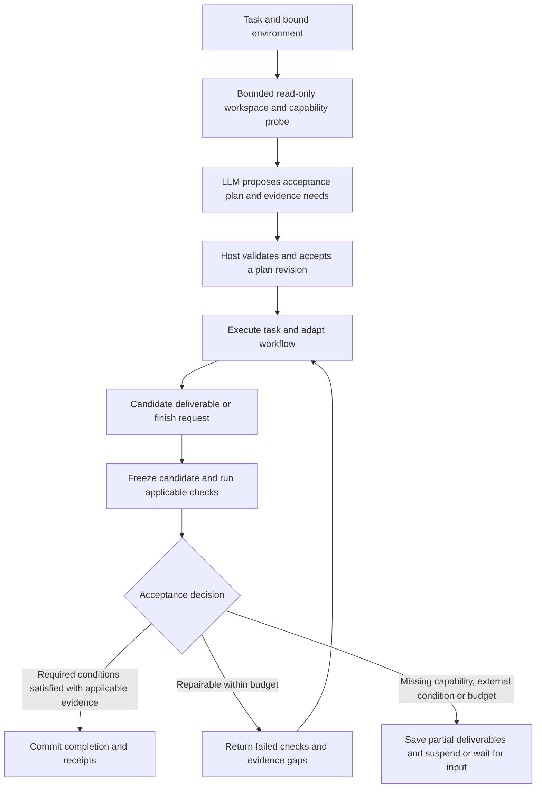

# Runtime task acceptance and verification gate

[中文](2026-10-10-runtime-acceptance-gate-design.zh-CN.md)

Status: design draft; runtime behavior has not changed. Date: 2026-10-10.

## 1. Objective

Dynamic task assembly selects tools, context policies and workflows. It also needs a mandatory answer to “what evidence establishes completion?” The runtime should inspect the task and its actual environment, establish an executable acceptance plan, verify candidate deliverables, and either complete, repair or suspend with explicit unmet requirements.

An execution plan describes actions. An acceptance plan describes conditions and evidence. Version them independently and connect workflow nodes to criterion IDs. Completed nodes, generated reports and successful commands are evidence inputs, not sufficient definitions of task success.

The facility applies to coding, research, writing, diagnosis, reasoning and mixed tasks, across all workflow policies. A simple task may have one criterion without entering multi-step planning. Its presence must not depend on whether the model selects a verification tool collection.

## 2. Existing implementation and integration points

| Location | Current behavior | Change |
| --- | --- | --- |
| `service/session_setup.py: SessionSetup.recommend` | Component recommendation uses the objective without workspace evidence | Treat it as a capability recommendation; probe the actual bound environment before establishing acceptance |
| `tasks/runner.py: _criteria_for_request` | Text success criteria come from expected_outputs or profile defaults | Preserve original requirements and constraints as versioned obligations |
| `tasks/assembly.py: TaskAssembly` | Shared environment, tools, workflow and checkpoint assembly | Own AcceptanceController and verifier registry |
| `tasks/assembly.py: completion_error` | Source retrieval, report presence and saved-file integrity checks | Incorporate existing checks into the broader task gate |
| `workflows/dynamic.py: complete_active` | Node criteria rely largely on supplied evidence text | Treat node completion as a claim; task completion requires the shared gate |
| `llm/managed_step.py: _finish / terminal / after_llm` | Multiple terminal and replay paths; limited output-contract recovery | Verify before committing terminal success; introduce bounded acceptance repair |
| `tasks/runner.py: _task_done` | Accepted finish or a parsed final answer can terminate | A final answer is a completion candidate and cannot bypass acceptance |
| `evaluation/verification_receipts.py` | File-scoped verification receipts and final artifact boundaries | Add versioned evidence domains for commands, artifacts, answer candidates and semantic judgments |
| `evaluation/behavior_facts.py` | Requires complete oracle coverage and applicable final-version binding | Consume acceptance events without equating a receipt with achieved |

Runtime acceptance closes the task loop. Base Eval reports its recorded facts; Deep Eval diagnoses behavior; Evolve proposes improvements. Offline evaluation does not substitute for runtime verification.

## 3. Main flow



Necessary read-only discovery may precede plan acceptance. Substantive execution should have an applicable acceptance plan. Acceptance requirements can reveal missing components and inform assembly changes, but cannot grant additional access or invent unavailable capabilities.

## 4. WorkspaceProbe

Probe bound resources instead of guessing from task labels. A test repair needs actual project language, test entry points, dependencies, existing modifications and target modules. Research needs output conventions, existing documents and available sources.

`WorkspaceProfile` records:

- Resource IDs, root and access mode. With no workspace, record `absent` and use session/artifact capabilities.
- A bounded directory inventory and evidence references/hashes for actual README files, manifests, test/lint/build configuration, CI definitions and document conventions.
- Project type, candidate verification entry points and scope, distinguishing observed facts from inferred recommendations.
- Existing modifications, environmental limitations, probe omissions, available tools and a profile fingerprint.

Limit file count, depth and bytes; exclude dependencies, caches, build outputs and secret files. Read candidate configuration without executing its scripts. A configured test command is an available candidate, not proof of relevance, executability or success. Run a baseline only as an explicit task-relevant check, not an implicit full suite at session creation.

## 5. AcceptancePlan

A plan binds its schema, ID, revision and revision reason to the current goal revision/digest and workspace profile digest. It retains original requirements with stable IDs, origin and source references. Criteria link to those requirement IDs and declare requiredness, verifier, target resource, check input, assertions, applicability scope and freshness policy. Unresolved requirements remain explicit.

Example criterion:

```json
{
  "id": "criterion:regression",
  "requirement_ids": ["req:1"],
  "description": "The targeted regression scenario passes",
  "required": true,
  "verifier": "command",
  "target": {"resource_id": "workspace", "cwd": "."},
  "check": {"tool_id": "process_execute", "input": {"argv": ["pytest", "tests/test_target.py"]}},
  "assertions": [{"kind": "exit_code", "equals": 0}],
  "scope": ["src/target.py", "tests/test_target.py", "pyproject.toml"],
  "freshness": "final_candidate"
}
```

This illustrates structure, not a universal Python test command. Real plans must cite observed project entry points and justify task relevance.

Preserve the complete objective and constraints alongside decomposed criteria. A model-selected subset cannot establish complete coverage. The host can deterministically validate provenance, IDs, resource bindings and executable checks; adequacy of a natural-language decomposition remains a semantic judgment, not a formal proof. Uncovered obligations must remain unresolved.

Revisions require base_revision, a reason and retained history. Goal changes invalidate the previous plan. Workflow changes need not invalidate unrelated checks. A failed required condition cannot be dropped, made optional or weakened merely to pass. Inapplicability needs evidence and replacement coverage. Distinguish user-authorized scope changes from agent-proposed verification-method changes.

Host plan acceptance validates structure and capabilities; it is not a mandatory user approval dialog. Ask for input only for genuinely missing requirements, existing policy obligations or additional authorization.

## 6. Verifier registry

| Verifier | Typical use | Evidence and limits |
| --- | --- | --- |
| `command` | Tests, lint/build, reproduction and regression checks | Host invokes registered execution tools and waits for an actual terminal result; save command, cwd, exit code and output. Process launch is not success |
| `artifact` | Files, reports and structured deliverables | Check presence, format, schema, content constraints and hashes. Nonempty output does not establish content correctness |
| `source` | Retrieved sources, resolvable citations and claim provenance | Bind to actual retrieval artifacts. Having a source does not establish that it supports a claim |
| `semantic` | Intent coverage, research conclusions, writing quality and answers lacking deterministic oracles | Separate bounded, read-only verifier call over the acceptance contract, candidate and relevant evidence; require per-criterion judgments with evidence |
| `external` | Human acceptance or externally observable outcomes | Only trusted external feedback can pass; missing feedback remains blocked |

Arbitrary tasks require composable verifiers, not the assumption that every outcome has an automatic oracle. Answer-only tasks use answer requirements and bounded semantic review; subjective or unobservable outcomes may need external acceptance. Retain verification method and assurance separately for deterministic results and model judgments.

Commands must use the existing runtime, operation journal, cancellation and permission mechanisms. Do not create an unrecorded shell execution path. Exit code zero establishes only its declared assertion; empty, irrelevant or weakened tests cannot establish task-wide acceptance.

## 7. Controller and completion protocol

Plan states: `missing → proposed → accepted → superseded`.

Check states: `pending / running / passed / failed / blocked / stale / waived`. A waiver needs applicable evidence or authorization and does not count as a passed check.

Gate states: `not_ready / verifying / passed / needs_repair / blocked`. Passing requires coverage of current obligations, satisfied required checks and applicable evidence bound to the candidate being committed.

Both finish calls and natural-language final answers enter `prepare_completion(candidate)`. Freeze candidate text and artifact versions, run or reuse valid checks, then `commit_completion`. Answer edits invalidate their semantic judgments. Goal or relevant workspace changes between verification and commit require revalidation.

Enforce this across final LLM/tool/child-loop workflow nodes, ordinary done predicates, managed-step terminal writes, terminal replay after resume, direct answers without task_control, and budget wrap-up. Intermediate nodes may advance execution without completing the entire task.

Failed verification should yield structured feedback and bounded repair instead of an immediate unrecoverable OUTPUT_CONTRACT_FAILED. Include failed criterion IDs, actual observations, evidence gaps, available next actions and remaining budget. Start with at most two repair rounds, stopping earlier on unchanged failure signatures without new evidence. Missing capabilities, external dependencies or insufficient budget preserve partial deliverables and use existing paused/waiting_input states with explicit unmet requirements.

## 8. Evidence, freshness and recovery

Host-generated `VerificationResult` records goal/plan/criterion revisions, verifier version, operation ID, candidate hashes, input/output references, scope, environment fingerprint, before/after versions, duration, usage, status and limitations. Models propose checks or semantic judgments; they cannot write authoritative passed receipts directly.

Define versioned evidence domains for files, artifacts, final answers and remote sources. Preserve existing v1 file-oracle and exclusivity requirements. Do not make new records appear valid by unconditionally assigning exclusive=true or coverage=complete.

Reuse requires unchanged goals, acceptance contracts, candidate content, relevant inputs/dependencies and environment. Potentially relevant writes make checks stale; unknown shell write effects conservatively invalidate workspace checks. Hashing a report alone cannot establish tested-code freshness. Shared workspaces need explicit concurrency limitations; git HEAD does not capture uncommitted or untracked changes.

Persist AcceptanceController in assembly snapshots. Reconcile interrupted running checks against the operation journal before retrying. An unknown operation result cannot become a pass or trigger automatic re-execution of side effects. Replaying a terminal checkpoint must recheck its binding to the current goal and candidate, not inherit acceptance from a previous task.

## 9. Budgets and presentation

Prefer valid existing results and deterministic project checks. Use semantic verification only for remaining conditions. Send a compact contract and relevant evidence, not the full execution trace; do not run Deep Eval on every finish.

Reserve verification budget when planning. All verifier tool/model calls count against task budgets and are tagged usage_role=verification. Configure per-check timeouts, total verification limits, output caps and bounded repair. Exhausted solver budgets cannot open an unlimited verification budget; retain explicit unverified scope.

Web/TUI shows workspace discoveries, acceptance criteria, the current check and the final decision. Display concrete activity such as targeted regression tests, failed citation checks or waiting for external feedback, with evidence links. Execution-plan progress and acceptance progress remain distinct.

Events include workspace.probed, acceptance.plan.proposed/accepted/revised, verification.started/completed, acceptance.invalidated and acceptance.gate.passed/blocked, all bound to task and goal revisions. Base Eval and Evolve consume these records.

## 10. Implementation sequence and acceptance tests

1. Add versioned AcceptancePlan, VerificationResult, GateDecision and AcceptanceController contracts, transitions, invalidation and snapshots.
2. Implement bounded read-only WorkspaceProbe and task/project-aware acceptance planning with coverage and capability validation.
3. Implement artifact, command and source verifiers, then a separate bounded semantic verifier, using existing execution and journaling.
4. Integrate the gate into every managed/unmanaged TaskAssembly completion path, with repair and suspension.
5. Add Web/TUI views, Base Eval consumption and checkpoint migration. Enable the gate for new tasks. Historical results remain historical; old checkpoints without acceptance must establish a plan for their current goal instead of inheriting completion claims.

Required end-to-end scenarios:

- Coding: actual project-specific regression failure blocks finish; repair and recheck passes; later relevant edits invalidate results.
- Research: workspace report delivery plus request coverage and citation support; an empty report, chat summary or URL list alone cannot satisfy the contract.
- Diagnosis: verify a read-only investigation through reproduction and evidence, without forcing unrelated edits or full test suites.
- No-workspace answers: use lightweight answer/semantic checks without inventing filesystem obligations.
- Goal changes and resumed sessions: preserve correct revisions and prevent cross-task receipt reuse.
- All terminal paths: final text, finish, terminal tool nodes and checkpoint replay cannot bypass acceptance; exhausted budgets retain partial outcomes.
- Runtime consistency: reject unbound resources and unavailable tools; cancelled commands, started-but-unfinished processes, network failures and missing dependencies never pass.
- Anti-regression: failed criteria cannot be removed to gain success; verifier prompts treat artifact instructions as data; invalid or timed-out verifier output remains unknown/blocked.

Acceptance of this change requires reproducing these runtime paths in tests, not merely adding a prompt instruction to verify before finishing.
