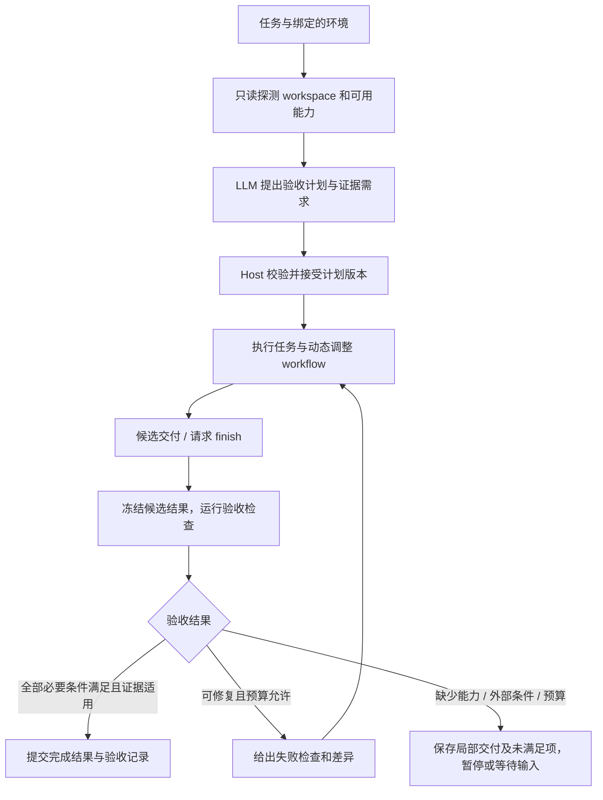

# 主 Loop 的任务验收与 Verify Gate

[English](2026-10-10-runtime-acceptance-gate-design.md)

状态：核心运行时已实现；当前边界及后续扩展见下文。日期：2026-10-10。

## 已实现范围（2026-10-10）

共享的 `TaskAssembly` 现在为一次性运行、Web、TUI 任务提供验收：探测绑定的 workspace，执行前生成有界 JSON 验收计划，并由宿主强制增加完整目标的独立语义检查。直接回答、`finish`、动态 workflow 最后节点和恢复后的完成 checkpoint 均经过 gate。明确失败会返回修复反馈，最多两轮；证据缺失、外部条件不可观察、验证输出无效或预算耗尽时暂停并保留候选结果。

命令检查走已注册工具和持久化操作日志。产物检查支持文件存在、非空文本和字面内容断言；来源检查要求真实检索记录。语义验证使用独立、无工具、有输出和时间限制的模型调用。验证证据保存为 artifact，Web 验收面板提供查看入口，TUI 展示验收事件，Base Eval 单独呈现事实。语义通过仍是模型判断。历史已完成任务不会被追认为已验收。

与下文完整设计相比，当前边界是：计划修订只支持保留旧条件并新增条件；外部验收暂时保持 blocked，尚无可信外部反馈录入 API。探测覆盖有界文件和配置，不保证发现所有依赖、git 修改或远端环境。有效性绑定候选文本、目标、计划、作用域文件 hash，并对任务工具写入保守失效；不能证明作用域外的并发修改不存在。超出证据审阅上限会阻塞，不会悄悄截断最终文档后宣称通过。持久化任务共享 token、模型调用和时间预算，沿用已有提前收尾机制保留余量，但不能保证任意供应商输入消耗下的固定额度。逐条件复用、自动替换验证方法仍是后续扩展。

可在全局配置选择 `models` 中已有的模型别名，省略时使用任务模型：

```yaml
verification_model: judge
```

任务规格支持以下默认值的覆盖：

```json
{"acceptance": {"max_checks": 8, "max_model_calls": 6, "max_seconds": 180,
  "max_repairs": 2, "max_prompt_chars": 48000, "max_output_tokens": 4096,
  "command_timeout_seconds": 60}}
```

`max_checks` 限制模型提出的条件数量，宿主另加完整目标检查。规划请求包含已注册命令工具的参数 schema；JSON 或检查参数格式错误时，先将具体校验错误反馈给模型，最多纠正一次，仍不合法再暂停。纠正共享既有时间、调用和 token 预算，不会执行非法计划。模型调用预算包含验收计划和语义判断；每次请求最多 60 秒且不超过剩余验收时间。验收预算不会扩充任务总预算。中断后结果未知的命令需先核对操作日志，不能自动重放。

New session 创建页及 LLM 推荐结果将验收明确展示为自动启用的运行时能力，并显示默认预算。推荐阶段不探测 workspace，也不产生正式验收计划；正式计划在绑定资源并开始执行后生成。Session TUI 和一次性任务 TUI 均有常驻验收区域，展示条件、通过数量、当前检查和失败原因；重新连接时从当前 run 的快照恢复，详细事件仍可在执行记录中展开。

以下章节保留完整设计目标，当前支持能力以上述实现范围为准。

## 1. 目标

Loom 可以根据任务选择工具、上下文策略和 workflow，但“如何证明任务已完成”必须成为每个任务的基础设施。主流程需要先理解任务与运行环境，再形成可执行的验收计划；交付候选结果时，运行时执行验证，决定继续修复、等待外部条件还是完成。

执行计划回答“接下来做什么”；验收计划回答“满足什么条件、拿到什么证据，才能算完成”。二者分别版本化，通过 criterion ID 关联。完成 workflow 节点、生成报告、命令退出码为零，都不能单独证明任务目标达成。

这套机制覆盖 coding、research、文档、诊断、纯推理和其他组合任务。适用所有 workflow；简单任务可只有一条验收标准，不要求进入多步骤规划模式。验收机制不依赖 LLM 是否在动态组装时选择了某个工具集合。

## 2. 当前代码的接入点与缺口

| 位置 | 当前行为 | 改造方向 |
| --- | --- | --- |
| `service/session_setup.py: SessionSetup.recommend` | 根据任务描述推荐组件，输入没有 workspace 证据 | 推荐仅作为能力建议；实际 workspace 绑定后再探测和制定验收计划 |
| `tasks/runner.py: _criteria_for_request` | 从 expected_outputs 或 profile 生成文字 success criteria | 保留原始目标、明确要求及约束，生成版本化验收义务，不用模板文字替代用户目标 |
| `tasks/assembly.py: TaskAssembly` | 统一绑定环境、工具、workflow、恢复状态 | 持有 AcceptanceController 和 verifier registry；所有完成路径共用 |
| `tasks/assembly.py: completion_error` | 检查来源读取、报告存在及文件 hash | 现有检查作为内置验收项；增加任务级 gate |
| `workflows/dynamic.py: complete_active` | completion_criteria 主要靠 evidence 文字声明，末节点才调用 completion_check | 节点结果作为候选证据，最终完成由任务 gate 裁决 |
| `llm/managed_step.py: _finish / terminal / after_llm` | 多条终止及重放路径，检查失败只给一次补救机会 | 在提交终止状态前统一验证；未通过时进入有预算的修复，不伪造 terminal completed |
| `tasks/runner.py: _task_done` | finish observation 或非 fallback 的最终回答可结束任务 | 自然语言最终回答也只构成候选交付，不能绕过 gate |
| `evaluation/verification_receipts.py` | 已有文件范围的 receipt 与最终版本绑定 | 扩展到命令、artifact、语义裁决等证据域；保留证据强度差异 |
| `evaluation/behavior_facts.py` | 目前严格要求完整 oracle、范围和最终版本绑定 | 消费验收计划与验证事件；不能把新 receipt 的出现直接解释成 achieved |

验收属于运行时闭环。Base Eval 读取已记录的计划、检查结果与最终判定；Deep Eval 分析为什么成功或失败；Evolve 消费行为改进假设。这三者都不替代运行时验收。

## 3. 主流程



顺序约束：可以先做必要的只读调查来消除需求或环境的不确定性；实质性执行前应有适用的验收计划。验收需求可能暴露组件缺口，触发重新配置工具或 workflow 的建议；建议不能自行扩张已绑定的访问权限。

## 4. WorkspaceProbe

探测必须基于实际绑定的 resource，不能仅根据任务类型猜测。例如“修复测试”需要确认项目语言、已有测试入口、依赖管理、当前修改状态和目标模块；“research”需要确认文档输出目录、已有分析文档及可用来源。

输出 `WorkspaceProfile`，包含：

- resource ID、根目录与访问模式；没有 workspace 时记录 `absent`，继续使用会话/artifact 能力。
- 有界目录清单，以及实际存在的 README、项目 manifest、测试/lint/build 配置、CI 配置、报告目录等证据引用和 hash。
- 项目类型、候选检查入口、测试范围和输出约定；每项区分 `observed` 与 `inferred`。
- 当前已有修改、环境限制、探测遗漏、工具可用性及 profile fingerprint。

探测遵守现有权限，限制文件数量、深度和读取字节数，跳过依赖、缓存、构建输出及秘密文件。只读取受限的候选配置，不执行其中的脚本。配置里存在 `test` 命令只说明有一个候选入口；它是否相关、能否运行和是否通过，都需要后续证据。Baseline 测试只在任务需要时作为显式检查执行，不在新建 Session 时隐式全量运行。

## 5. AcceptancePlan

每个计划至少包含：

```json
{
  "schema_version": 1,
  "id": "acceptance:...",
  "revision": 1,
  "goal_revision": 3,
  "goal_digest": "...",
  "workspace_profile_digest": "...",
  "requirements": [
    {"id": "req:1", "description": "原始用户要求", "origin": "user", "source_ref": "..."}
  ],
  "criteria": [
    {
      "id": "criterion:regression",
      "requirement_ids": ["req:1"],
      "description": "目标缺陷的回归场景通过",
      "required": true,
      "verifier": "command",
      "target": {"resource_id": "workspace", "cwd": "."},
      "check": {"tool_id": "process_execute", "input": {"argv": ["pytest", "tests/test_target.py"]}},
      "assertions": [{"kind": "exit_code", "equals": 0}],
      "scope": ["src/target.py", "tests/test_target.py", "pyproject.toml"],
      "freshness": "final_candidate"
    }
  ],
  "unresolved_requirements": [],
  "revision_reason": "Initial plan based on task and observed project configuration"
}
```

上述命令仅为结构示例，不能作为所有 Python 项目的默认验收。真正计划必须引用探测到的项目入口及任务范围。

计划必须完整保留用户目标及约束，再建立 requirement → criterion → check 的对应关系。LLM 分解的子集不能自行声明覆盖完整目标。Host 可以确定性检查来源、ID、绑定和可执行性；对“子条件是否覆盖自然语言目标”的判断，应显式标记为语义判断，不能伪装成形式证明。缺少覆盖的要求保留在 unresolved_requirements，不能静默删除。

计划修订使用 base_revision，保留旧版和修改原因。任务目标变更使旧验收失效；执行步骤变化不必重置无关验收。失败后不能通过删掉必需项、把 required 改为 optional 或放宽阈值来通过；若新证据表明检查不适用，必须保存依据和替代覆盖。用户授权的范围变更与 agent 自行调整验收方法分别记录。

Host 接受计划是结构与能力校验，不意味着每个任务都向用户请求确认。只有实际缺失需求、已有策略要求或新增授权需求才进入 waiting_input。

## 6. Verifier Registry

| Verifier | 适用范围 | 证据与限制 |
| --- | --- | --- |
| `command` | 项目测试、lint/build、复现与修复检查 | Host 调用已注册执行工具，等待真实终态，保存命令、cwd、退出码和输出；进程启动成功不等于验证通过 |
| `artifact` | 文件/报告/结构化产物交付 | 对绑定 resource 或 artifact 做存在性、格式、schema、内容约束及 hash 检查；文件非空不等于内容正确 |
| `source` | research 的来源读取、引用可解析、结论溯源 | 使用实际检索结果与 artifact 引用；有来源不等于来源支持结论 |
| `semantic` | 意图覆盖、研究结论、文档质量、无法确定性判定的回答 | 独立、有界的 verifier 调用，只读验收合同、候选交付和相关证据；输出逐项裁决及证据，不复用 solver 的“已经完成”声明 |
| `external` | 人工验收或环境外的结果 | 只有可信外部反馈可以通过；等待期间标记 blocked，不由 solver 自报通过 |

“任意任务”意味着 verifier 可组合、可扩展，并不意味着每个任务都有自动 oracle。无 workspace 的问答应检查最终回答与用户目标是否对应；主观偏好或不可观测结果可要求 external 验收。确定性结果与语义裁决分别保留 `method` 和 `assurance`。

命令验证必须经过现有 runtime、operation journal、取消和权限机制，不能在 verifier 中另开未经记录的 shell 后门。退出码零只满足对应检查；验收是否足以覆盖任务目标是另一项义务。测试被改弱、空测试集、无关测试等不能由“退出码零”掩盖。

## 7. AcceptanceController 与终止协议

验收计划状态：`missing → proposed → accepted → superseded`。

检查状态：`pending / running / passed / failed / blocked / stale / waived`。waived 必须有可追溯的适用性或授权依据，不能直接计作 passed。

Gate 状态：`not_ready / verifying / passed / needs_repair / blocked`。只有完整覆盖当前要求、必需检查全部满足、候选结果绑定仍然有效时，才能进入 passed。

对 `finish` 和自然语言最终回答统一调用 `prepare_completion(candidate)`，先冻结候选回答和 artifact 的版本，再运行或复用有效的检查，最后 `commit_completion`。文本变化必须使对应的语义裁决失效。完成检查和发布交付之间若有 workspace 或目标变化，必须重新验证。

不仅包装 finish 工具，还必须覆盖：动态 workflow 最后一个 LLM/tool/child-loop 节点、普通 loop 的 done、managed step 的终态写入、恢复后的 terminal 重放、没有 task_control 工具的直接回答、预算耗尽的 wrap-up。非最终节点可以推进执行，不得借此完成整个任务。

未通过不应马上产生不可恢复的 OUTPUT_CONTRACT_FAILED。返回结构化验收差异：哪个条件失败、证据是什么、可执行的下一步和剩余预算。允许有限修复，建议默认最多两轮；同一失败签名且没有新证据时提前停止。缺工具、环境不可用、需要用户输入或预算不足时保存部分交付，进入现有 paused/waiting_input 流程，明确未完成项。

## 8. 证据、时效性与恢复

`VerificationResult` 必须由 Host 生成，包括：goal/plan/criterion revision、verifier 版本、执行 operation ID、候选交付 hash、输入/输出证据引用、适用范围、环境 fingerprint、检查前后版本、耗时、usage、status 和失败原因。模型只能提出检查或裁决文本，不能直接写入 Host 的 passed receipt。

区分文件、artifact、会话最终回答及远程来源等证据域。沿用目前 v1 的完整文件 oracle 与 exclusive 约束；为新证据域定义版本化 receipt，不通过把所有结果设置为 `exclusive=true` 或 `coverage=complete` 来绕过现有分析器。

复用前必须确认目标、验收合同、候选结果、相关输入/依赖和环境均未变化。任意可能影响验收范围的后续写操作使相关结果 stale；无法判断作用范围的 shell 写入保守地使 workspace 检查失效。不能只 hash 最终报告而忽略被测试代码、依赖或外部状态。无法保证独占的共享 workspace 明确记录限制；git HEAD 本身不覆盖未提交和未跟踪内容。

AcceptanceController 随 assembly snapshot 持久化。重启后 running 的检查进入待核对状态，优先恢复 operation journal 的终态；未知结果不能重执行有副作用的检查或当作通过。恢复终态时重新确认 gate 与当前目标/候选的一致性，避免沿用上一轮的验收。

## 9. 预算与可见性

优先使用已有有效检查结果和项目确定性工具；语义验收仅用于剩余无法自动判定的条件。输入为紧凑的验收合同和局部证据，不重新读取完整执行轨迹，不把 Deep Eval 放进每次 finish。

制定验收计划时，预留验证预算；所有验证模型/工具调用计入任务总预算，并标记 usage_role=verification。不能在 solver 耗尽预算后另外开无限调用。支持检查超时、总验证预算、模型输出上限和最多修复次数；预算不足时输出未验证范围。

Web/TUI 显示四块内容：项目探测摘要、验收条件、当前检查、最终验收结果。显示“正在运行目标回归测试”“报告引用检查失败”“等待外部反馈”等具体状态，并提供证据入口。计划进度与验收进度分别展示。

事件至少包括 workspace.probed、acceptance.plan.proposed/accepted/revised、verification.started/completed、acceptance.invalidated、acceptance.gate.passed/blocked。事件必须绑定当前 task/goal revision；Base Eval 和 Evolve 通过这些事实消费结果。

## 10. 分阶段实施与测试

1. 建立版本化 AcceptancePlan、VerificationResult、GateDecision 和 AcceptanceController；明确状态机、revision、失效规则及快照。
2. 实现有界只读 WorkspaceProbe；从真实任务、项目配置和工具能力生成验收计划，完成覆盖及可执行性校验。
3. 接入 artifact、command、source verifier，再加入独立有界 semantic verifier；复用现有工具执行和 journal。
4. 在 TaskAssembly 与 managed/unmanaged loop 的所有终止路径接入统一 gate；验证失败可回到执行和有限修复。
5. 增加 Web/TUI 展示、Base Eval 消费和恢复迁移；新任务启用统一 gate，历史结果不追溯改写为已验收。老 checkpoint 若缺少验收状态，恢复时建立当前目标的计划，不继承“已完成”声明。

必须覆盖的端到端场景：

- Coding：从真实项目配置选取针对性回归检查；失败阻止 finish，修复后重验通过；验证后修改相关文件使结果 stale。
- Research：报告确实写入 workspace，同时检查请求覆盖与引用支持；只创建空文档、只给聊天摘要或只提供 URL 均不能满足完整验收。
- Diagnosis：允许只读任务，用复现与证据链验收结论，不强迫修改项目或运行无关全量测试。
- 无 workspace 的简单回答：走轻量语义/结构验收，无需虚构文件或工程测试。
- 多轮任务：新增目标、修订要求、暂停恢复和新任务复用 Session 时，验收范围不串用。
- 各种终止路径：自然语言回答、finish、最后 tool 节点、terminal 重放均不能绕过 gate；预算耗尽只保存局部结果。
- 安全与运行一致性：禁止越权路径、工具或新增权限；命令取消、进程启动未结束、网络失败、缺失依赖均不记为 passed。
- 防止退化：不能删除失败标准求通过；语义 verifier 不遵循产物中的指令；校验器输出无效或模型超时保留 unknown/blocked。

验收本改造的条件是这些真实路径可被测试复现，而不是仅在 prompt 中增加一句“完成前请验证”。
